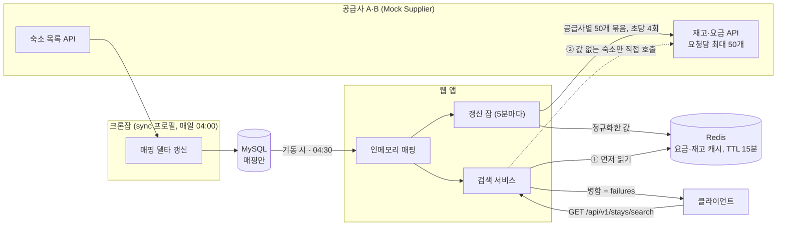

# stay-supplier-integration

여러 외부 숙박 공급사(Supplier)의 상품을 자사 표준 숙박 상품 모델로 통합하고, 날짜·인원 검색 한 번으로 어느 공급사 상품이든 같은 형태로 돌려주는 연동 백엔드다. 공급사 A·B는 이 저장소의 Mock Supplier가 대신한다.

Java 21 · Spring Boot 4.0 · Spring MVC + WebClient · MyBatis + MySQL 8.4 · Redis 7.4 · Gradle (Kotlin DSL)

## 1. 빠른 시작

JDK 21과 Docker가 필요하다. JDK는 mise를 쓰면 `mise trust && mise install`로 받는다(버전은 `mise.toml`에 고정). 터미널 세 개를 쓴다.

```bash
docker compose up -d                                        # MySQL + Redis
./gradlew :mock-supplier:bootRun                            # 터미널 2: Mock Supplier (9090)
./gradlew :bootRun --args='--spring.profiles.active=sync'   # 처음 한 번: 매핑 갱신 잡 1회 실행 후 종료
./gradlew :bootRun                                          # 터미널 3: 애플리케이션 (8080)
curl 'http://localhost:8080/api/v1/stays/search?checkIn=2026-09-20&checkOut=2026-09-23&adults=2&children=0'
```

- 테스트: `./gradlew build` (Docker가 떠 있어야 Testcontainers 통합 테스트가 돈다)
- API 문서(Swagger UI): http://localhost:8080/swagger-ui.html
- `bootRun` 앞의 `:`는 루트 모듈만 실행한다는 뜻이다. 없으면 Mock 모듈까지 같이 뜬다
- 검색 날짜는 오늘부터 30일 안이면 캐시를 탄다. 포트 변경과 장애·부분 실패 확인 절차는 [5장](#5-실행-상세)

## 2. 무엇을 만들었나

공급사마다 같은 상품을 다르게 표현하고(요금은 날짜별 단가·세금 별도 vs 기간 총액·세금 포함), 실패를 알리는 방식도 다르다(HTTP 상태 코드 vs 항상 200 + 본문 코드). 공급사 API는 위치로 검색해 주지 않고 숙소 코드 목록을 받아 재고·요금만 돌려주며, 한 요청에 50개까지다. 그리고 외부 연동은 실패한다. 이 성격에 맞춰 아래를 만들었다.

| 항목 | 상태 | 핵심 | 명세 |
|---|---|---|---|
| ① 표준 숙박 상품 모델 + 매핑 저장 | 구현 | 숙소 → 객실 타입 → 날짜별 재고·요금. 공급사 코드 ↔ 내부 식별자는 DB에 두고 크론잡이 매일 델타로 갱신 | [stay-model.md](docs/stay-model.md) |
| ② Supplier 어댑터 | 구현 | 공급사별 형식은 어댑터 패키지 안에만. A의 HTTP 상태와 B의 `resultCode`를 같은 실패 사유 8가지로 통일 | [architecture.md 4.1~4.2](docs/architecture.md) |
| ③ 통합 검색 API | 구현 | 50개 묶음 병렬 조회, 연박 판정(최솟값), 예약 불가 기본 제외, 부분 실패는 `failures`로 | [stay-search-api.md](docs/stay-search-api.md) |
| ④ 연동 견고성 | 구현 | 연결 1초·응답 3초, 한 공급사가 죽어도 나머지로 응답 | [architecture.md 4.3~4.4](docs/architecture.md) |
| ⑤ Mock Supplier | 구현 | 정상·장애·무응답 모드를 API로 전환 | [architecture.md 5장](docs/architecture.md) |
| 요금·재고 캐시 (선택) | 구현 | Redis에 5분마다 미리 채우고 검색은 Redis 우선. 비어 있으면 직접 호출 | [architecture.md 4.8](docs/architecture.md) |
| 재시도 (선택) | 구현 | 크론잡 고정 30초 × 3회, 검색 즉시 1회, 갱신 잡 429 지수 백오프 | [architecture.md 4.6](docs/architecture.md) |
| 정규화 실패 격리 (선택) | 부분 | 깨진 항목만 버리고 원인과 함께 로그. 격리 저장소는 없음 | [architecture.md 4.1](docs/architecture.md) |
| 연동 지표·모니터, 서킷 브레이커 | 설계만 | 지표 정의, 알림 규칙, 한도 탐색 절차. 코드에는 실패 로그만 | [architecture.md 4.6~4.7](docs/architecture.md) |
| 중복 상품 병합·통화 처리·예약 대행 | 미구현 | [7장](#7-한계와-향후-개선) | |

범위 밖: 인증·인가, 결제, 관리자 기능, 프론트엔드, 실제 외부 상용 API 연동, 지역·키워드 필터, 정렬·페이징.

## 3. 어떻게 동작하나



1. 매핑(하루 1회): 크론잡이 공급사 숙소 목록을 받아 자사 숙소·객실 타입 식별자와의 매핑을 DB에 델타로 저장한다. 웹 앱은 기동 시와 04:30에 DB에서 인메모리로 올린다.
2. 캐시(5분마다): 갱신 잡이 매핑의 숙소를 공급사별 50개씩 묶어 재고·요금 API를 부르고, 정규화한 값을 Redis에 숙소당 Hash로 채운다.
3. 검색: 요청(날짜·인원)이 오면 Redis를 먼저 읽고, 값이 없는 숙소만(첫 바퀴 전·창 밖 날짜·Redis 장애, 또는 `fresh=true`) 공급사를 병렬 호출한다. 결과는 내부 식별자로 바꿔 병합하고, 실패한 공급사는 `failures`에 적는다.

유스케이스별 기본·대안 흐름은 [architecture.md 3장](docs/architecture.md)에 있다.

## 4. 설계 결정

결정마다 선택·근거·잃는 것을 적는다. 선택지 비교와 폐기한 대안은 [JOURNAL.md](JOURNAL.md)의 "설계 의사결정 기록"에 있다.

### 4.1 표준 숙박 상품 모델

단위는 숙소 → 객실 타입 → (날짜별) 재고·요금이다. 어댑터가 공급사 응답을 이 단위로 바꾸고, 식별자는 공급사 코드 그대로 두며 내부 식별자는 매핑(4.2)이 붙인다.

**살린 정보와 버린 정보**

| 정보 | Supplier A | Supplier B | 표준 모델 | 비고 |
|---|---|---|---|---|
| 숙소 코드·이름 | `hotelCode`, `hotelName` | `propertyId`, `propertyName` | `hotelCode`, `hotelName` | 매핑이 내부 식별자를 붙인다 |
| 객실 타입 코드·이름 | `roomTypeCode`, `roomTypeName` | `roomId`, `roomName` | `roomTypeCode`, `roomTypeName` | 숙소 안에서만 유일 |
| 최대 수용 인원 | `maxOccupancy` | `maxOccupancy` | `maxOccupancy` | 성인+아동 합산. 없으면 미상(null)으로 저장. 검색 응답은 필수라 재고·요금 응답 값 → 매핑 값 순으로 채우고, 둘 다 없으면 그 객실 타입을 응답에서 제외 |
| 재고 | `dailyRates[].remainingRooms` | `inventory[].remainingRooms` | 날짜별 재고 → 기간 최솟값 `availableRooms` | 4.4 연박 판정 |
| 요금 | `nightlyRate` + `taxAmount` (세금 별도, 날짜별) | `totalPrice` (세금 포함, 기간 총액) | `totalPrice` 세금 포함 총액 + `currency` | 아래 요금 기준 |
| 조식 포함 여부 | `breakfastIncluded` | `breakfastIncluded` | `breakfastIncluded` | 같은 객실도 공급사마다 달라 요금 비교의 조건 |
| 통화 | `currency` | `currency` | `currency` | ISO 4217, 금액은 최소 단위 정수 |
| 버림 | 날짜별 단가·세금 내역 (총액으로 합쳐짐) | `resultCode`, `resultMessage` (판정에만 사용), `taxIncluded` (항상 true) | | 공급사 원본 응답은 저장하지 않는다 |

**요금 기준**
- 선택: 세금 포함 총액(고객 결제 금액). A는 날짜별 (nightlyRate + taxAmount)의 합, B는 totalPrice 그대로. 캐시에는 세금 포함 1박 값을 둔다.
- 근거: B가 세금 금액을 따로 주지 않아 세금 별도 기준으로는 두 공급사를 통일할 수 없다. 둘이 공통으로 만들 수 있는 값은 결제 금액뿐이다.
- 잃는 것: A의 세금 내역과 날짜별 단가가 응답에서 사라진다. 세금 별도 표시가 필요하면 A만 가능하다.

**재고 표현**
- 선택: 날짜별 `remainingRooms`를 그대로 받아 기간의 최솟값을 `availableRooms`로 낸다. 별도 boolean은 두지 않고 0이면 예약 불가다.
- 근거: 두 공급사 모두 날짜별 정수 재고를 주므로 변환 없이 같은 단위다.
- 잃는 것: 날짜별 재고 내역은 응답에 없다.

### 4.2 매핑

**무엇을 저장하고 언제 갱신하나**
- 선택: 숙소·객실 타입(정적)만 DB 매핑 테이블에 저장하고 재고·요금(동적)은 저장하지 않는다. 갱신은 K8s CronJob이 매일 04:00 Asia/Seoul에 별도 팟(`sync` 프로필, 웹 서버 없이 1회 실행 후 종료)으로 돌린다. 웹 앱은 공급사 목록 API를 부르지 않고 기동 시와 04:30에 DB에서 인메모리로 읽는다. 공급사 하나가 실패하면 그 공급사만 건너뛰고 기존 매핑을 유지한다. 첫 배포와 DB 초기화 뒤에는 CronJob을 즉시 한 번 실행한 뒤 웹 앱을 띄운다.
- 근거: 숙소 정보는 일·주 단위, 요금은 시간 단위, 재고는 예약마다 바뀐다([도메인 리서치 4장](docs/domain-research.md)). 자주 안 바뀌는 것은 저장하고 매번 바뀌는 것은 매번 묻는다. 쓰기(갱신)와 읽기(검색)를 프로세스로 나누면 인스턴스가 여러 대여도 갱신은 한 곳에서만 일어나고, 웹 앱은 공급사 장애와 무관하게 기동한다. 04:00은 일반 웹 트래픽의 최저 시간대(03~05시)를 기준으로 잡은 값이며 운영에서 시간대별 검색량 지표로 조정한다.
- 잃는 것: 갱신 사이에 추가된 숙소는 최대 하루 늦게 검색에 나온다. 크론잡을 수동으로 즉시 돌린 경우 웹 앱은 04:30이나 롤링 재시작 전까지 옛 매핑을 쓴다. 사라진 숙소는 비활성으로만 두므로 테이블이 줄지 않는다.

**내부 식별자 안정성**
- 선택: BIGINT 자동 증가 식별자 + `(supplier, supplier_hotel_code)` 유니크 키 + upsert(`INSERT … ON DUPLICATE KEY UPDATE`). 객실 타입은 `(hotel_id, supplier_room_type_code)` 유니크 키. 행은 삭제하지 않고 `active`로만 관리한다.
- 근거: 유니크 키가 동시 실행과 재실행에서 같은 행을 보장하고, 삭제하지 않으므로 사라졌다 돌아온 숙소도 같은 식별자를 유지한다. 객실 타입 코드는 숙소 안에서만 유일하므로 키에 숙소가 들어간다. 공급사 코드 대신 내부 식별자를 두는 이유는 찜·예약 내역·리뷰가 매달릴 우리 식별자가 필요하고, 공급사 교체·코드 체계 변경이 매핑 테이블 밖으로 번지지 않게 하며, 응답에 공급망을 드러내지 않기 위해서다.
- 잃는 것: DB를 초기화하면 식별자가 달라진다. 운영에서는 초기화하지 않는 것이 전제다.
- 자세히: [stay-model.md 3장](docs/stay-model.md)

### 4.3 Supplier 어댑터

**경계와 실패 판정**
- 선택: 공통 인터페이스 `SupplierClient` 하나로 호출하고 응답을 표준 형태로 바꿔서 돌려준다. 공급사 전용 응답 형식은 공급사 패키지 밖으로 나가지 않는다. 실패는 A의 HTTP 상태 코드와 B의 `resultCode`를 같은 `FailureReason` 8가지(잘못된 요청, 인증 실패, 한도 초과, 공급사 오류, 일시 장애, 타임아웃, 연결 실패, 깨진 응답)로 바꿔 `SupplierCallException` 하나로 던진다. 어댑터는 호출과 번역까지만 하고 저장·병합·캐시·재시도는 호출하는 쪽이 한다.
- 근거: B는 장애여도 HTTP 200을 주므로 `resultCode`를 안 읽으면 장애를 정상으로 처리한다. 원인을 하나의 목록으로 모아야 크론잡과 검색이 재시도·알림 규칙을 공급사와 무관하게 쓸 수 있다. 같은 어댑터를 크론잡(DB 저장)·갱신 잡(캐시)·검색(응답)이 다르게 쓰므로 저장은 어댑터 밖에 둔다.
- 잃는 것: 공급사 원본 오류 메시지는 예외의 원본 코드와 로그에만 남고 응답에는 나가지 않는다. 코드·이름이 빠진 항목은 버리고, 최대 인원이 빠진 객실 타입은 미상으로 저장한다. 기본값을 넣어 추측하지 않는다.
- 자세히: [architecture.md 4.1~4.2](docs/architecture.md)

**신규 Supplier 추가 시 수정 범위**
- 추가: `Supplier` enum 값, `supplier/c` 패키지(클라이언트·전용 응답 형식·실패 판정 규칙), `supplier.endpoints.c.*` 설정, WireMock 테스트.
- 건드리지 않음: 크론잡, 매핑 테이블·매퍼, 검색 서비스, 표준 형태, WebClient 구성. 설정을 빠뜨리면 기동 시 바로 실패한다.
- 자세히: [architecture.md 4.5](docs/architecture.md)

### 4.4 통합 검색 API

**연박 예약 가능 객실 수**
- 선택: 요청 기간(체크인일부터 체크아웃 전날까지)의 날짜별 `remainingRooms` 중 최솟값. 0이면 예약 불가. 요금은 A는 날짜별 (nightlyRate + taxAmount)의 합, B는 totalPrice 그대로.
- 근거: N박은 같은 객실 타입을 N일 연속으로 잡아야 하므로 하루라도 재고가 0이면 그 기간을 통째로 예약할 수 없다. 응답이 객실 타입 단위이고 호실이 없으므로 이 이상의 판정은 할 수 없다.
- 잃는 것: 하루가 비는 날 다른 객실 타입으로 대체하는 판매 방식(업그레이드·분할 예약)은 반영하지 않는다. 각 객실 타입을 독립된 상품으로 본다.

**예약 불가 상품**
- 선택: 예약 가능 객실 수가 0인 객실 타입은 응답에서 제외한다. 객실 타입이 모두 빠진 숙소도 제외한다. `includeSoldOut=true`를 주면 `availableRooms: 0`으로 포함한다.
- 근거: 소비자 화면(OTA 앱)은 매진 숙소를 "Sold out"으로 남겨 희소성을 연출하는 관행이 있지만, 공급사·집계 API(Expedia Rapid 등)는 예약 가능한 객실만 돌려준다. 이 API는 화면이 아니라 앱 백엔드가 쓰는 집계 API이고 프론트엔드는 비범위이므로 B2B 관행을 따르고, 매진 노출은 화면이 옵션으로 켤 수 있게 둔다([도메인 리서치 4장](docs/domain-research.md)).
- 잃는 것: 기본 응답만으로는 매진 표시를 할 수 없고, 제외된 개수도 응답에 없다. 캐시에는 재고 0도 저장한다. 그래야 판정할 수 있다.

**부분 실패 표현**
- 선택: 일부 공급사가 실패하면 200으로 성공한 결과를 주고 `failures: [{ supplier, reason }]`에 실패 사실을 담는다. 모든 공급사가 실패하면 503과 `Retry-After`, 요청 자체가 잘못되면 400이고 공급사를 부르지 않는다. 묶음 일부 실패는 실패한 묶음의 숙소 수도 함께 적는다.
- 근거: 상태 코드를 206·207로 바꾸면 대부분의 클라이언트가 오류로 처리한다. 전부 실패에 빈 200을 주면 "예약 가능한 숙소가 없다"로 오해된다.
- 잃는 것: 실패한 공급사의 상품은 이번 응답에 없다. 클라이언트가 `failures`를 읽지 않으면 부분 결과를 전체로 오해할 수 있다.

**대량 숙소 조회**
- 선택: 어댑터가 공급사 한도(요청당 50개)를 알고 안에서 잘라 병렬 호출한다. 평소 검색은 미리 채운 Redis만 읽으므로 숙소 수와 무관하게 ms다. Redis가 비었을 때(장애·초기화)만 검색이 직접 호출하며, 호출 예산은 공급사당 초당 4회(설정값)라 1,000개는 5초면 전부 캐시에 들어간다.
- 근거: 초당 한도가 스펙에 없고 실제 공급사 공개값이 0.8~10회다. 1,000개를 3초 안에 다 훑으려면 초당 8회가 필요해 호출 속도로는 풀리지 않고, 검색 응답이 3초를 넘기면 이탈이 급증한다([도메인 리서치 4장](docs/domain-research.md)). 캐시가 완전히 비는 것은 Redis 장애뿐인 예외 케이스라 그때 5초 복구를 받아들인다.
- 잃는 것: 숙소가 늘면 갱신 잡 한 바퀴가 길어진다(1,000개 2.6분, 5,000개 13분). 5,000개부터는 날짜 거리별 주기 계층과 공급사 한도 협의가 필요하며 확장 설계로만 남긴다. 3초 예산을 넘긴 숙소를 `pending`으로 표시하는 부분 응답도 확장 설계다(지금은 공급사별 타임아웃 3초가 상한).

### 4.5 연동 견고성

**타임아웃**
- 선택: 연결 1초, 응답 3초. 공급사별 설정값(`supplier.endpoints.{a|b}.connect-timeout`, `response-timeout`)이고 WebClient에 미리 적용한다.
- 근거: 연결은 같은 리전이면 수십 ms라 1초를 넘으면 네트워크 문제로 본다. 응답은 사용자가 기다리는 검색 요청이고 병렬 호출의 전체 지연은 가장 느린 공급사로 정해진다. 3초를 넘기면 그 공급사를 부분 실패로 넘겨 나머지 결과를 먼저 준다.
- 잃는 것: 느린 공급사의 정상 응답을 3초에 끊는다. p95 지연 모니터(설계)로 값을 재검토한다.

**재시도 (선택, 구현)**
- 선택: 호출하는 쪽마다 다르다. 크론잡은 연결 실패·타임아웃·공급사 오류·일시 장애·한도 초과를 고정 30초 간격으로 3회, 검색은 연결 실패·공급사 오류·일시 장애만 200ms 뒤 1회, 갱신 잡은 한도 초과(429)에만 지수 백오프(1→2→4초, 60초 상한, 최대 5회). 잘못된 요청·인증 실패·깨진 응답은 어디서도 재시도하지 않는다.
- 근거: 같은 실패라도 새벽 배치는 기다릴 수 있고 사용자 요청은 기다릴 수 없다. 검색에서 타임아웃을 재시도하면 3초를 두 번 쓰게 되어 뺐다. 429는 더 기다려야 풀리는 실패라 간격을 늘린다.
- 잃는 것: 검색 1회 재시도는 순간 장애만 흡수한다. 그 이상은 캐시와 부분 실패로 받는다.

**외부 연결 실패 알림과 서킷 브레이커 (설계만)**
- 선택: 공급사·DB·Redis 연결 실패는 원인이 무엇이든 1건 이상이면 알린다. 같은 대상·같은 원인은 5분 창에서 하나로 묶고, 비율이 임계를 넘으면 긴급으로 올린다. 지표를 코드에 넣지 않으므로 알림의 근거는 실패마다 남기는 로그(공급사·원인·원본 코드)다. 서킷 브레이커는 반복 실패 공급사를 끊는 조건과 복구 조건만 정했다.
- 근거: 조용히 넘어가는 외부 실패가 가장 늦게 발견되는 장애다. 부분 실패를 허용하는 설계일수록 실패가 응답에서 가려지므로 알림으로 보완한다.
- 자세히: [architecture.md 4.6~4.7](docs/architecture.md)

### 4.6 요금·재고 캐시 (선택, 구현)
- 선택: Redis 공유 캐시에 미리 채운다. 웹 앱의 갱신 잡이 5분마다 인메모리 매핑의 공급사별 50개 묶음으로 재고·요금 API를 부르고, 정규화한 값을 숙소당 Hash(`stay:v1:{hotelId}`, 필드 `{roomTypeId}:{yyyyMMdd}`, 값 `재고|세금 포함 1박|통화|조식|최대 인원`)에 통째로 교체해 올린다. 창은 오늘부터 30일, TTL은 주기 × 3(15분), 호출 속도는 공급사당 초당 4회(429면 절반). B는 기간 총액만 주므로 날짜마다 1박으로 불러 그날 값으로 저장하고 연박 요금은 1박 값의 합으로 계산한다. 검색은 Redis를 먼저 읽고 값이 없는 숙소만 직접 호출하며, `fresh=true`면 전부 직접 호출한다. 요금·재고는 DB에 저장하지 않는다.
- 근거: 인스턴스별 캐시는 여러 대일 때 효과가 희석되고 공급사 호출이 대수만큼 늘어난다. 키 하나의 변경 간격(요금 30분~2시간, 재고 1.6~5시간)이 인기 키의 검색 간격(분 단위)보다 길어 캐시가 성립한다([도메인 리서치 4장](docs/domain-research.md)). 검색 시점에 채우는 캐시 어사이드는 콜드 검색이 초 단위가 되어 택하지 않았다.
- 잃는 것: 갱신 주기만큼 옛 값을 보여줄 수 있고, B의 연박 요금은 연박 할인이 있으면 실제와 다를 수 있다. 검색 결과는 참고값으로 두고 예약 직전에 `fresh=true`로 재확인한다. 설계만 남긴 것: 날짜 거리별 주기 계층, 남은 객실 ≤ 2 핫 리스트, 첫 바퀴와 readiness 연동, 팟 여러 대일 때 갱신 잡 리더 선출.
- 자세히: [architecture.md 4.8](docs/architecture.md)

### 4.7 기술 선택

**Spring MVC + WebClient (WebFlux 전면 전환 안 함)**
- 선택: Spring MVC 위에서 공급사 호출에만 WebClient를 쓴다. 병렬 호출은 Reactor 체인(`Flux.flatMap`)으로 만들고 끝에서 한 번 `block()`한다. 가상 스레드는 켜지 않는다.
- 근거: 병렬·타임아웃·부분 실패가 필요한 곳은 공급사 호출뿐이고, MyBatis·크론잡·인메모리 조회는 블로킹이다. WebFlux 전면 전환은 MyBatis와 맞지 않고 얻는 것보다 복잡도가 크다. 가상 스레드는 블로킹 클라이언트로 병렬을 만들 때 유용한데 WebClient는 논블로킹이라 필요가 없다.
- 잃는 것: 검색 요청 스레드 하나가 `block()`으로 대기한다. 검색 QPS가 매우 높으면 MVC 스레드 풀이 병목이 될 수 있어 그때 가상 스레드 설정(`spring.threads.virtual.enabled`)을 검토한다.

**모듈·패키지 구조**
- 선택: Gradle 멀티 모듈(본 앱 + Mock Supplier, 코드 공유 없음). 본 앱은 기능별 패키지(`supplier`, `supplier.a/b`, `stay`, `mapping`, `cache`, `search`, `config`).
- 근거: Mock은 외부 시스템 대역이라 본 앱 DTO를 공유하면 경계가 무너진다. 기능별 패키지는 공급사 전용 형식을 `supplier.a/b` 안에 가둘 수 있고, 새 공급사가 폴더 하나로 끝난다.
- 잃는 것: 계층별 구조에 익숙한 사람에게는 낯설다. 멀티 모듈이라 `./gradlew bootRun`에 `:`를 붙여야 한다.

## 5. 실행 상세

### 요구 사항과 포트
- JDK 21 (mise를 쓰면 `mise trust && mise install`. 다른 JDK 21이 PATH에 있어도 된다), Docker (로컬 MySQL·Redis, 테스트의 Testcontainers)
- 포트: 8080(앱), 9090(Mock), 3306(MySQL), 6379(Redis)
- 충돌 시: MySQL은 `MYSQL_PORT=3307 docker compose up -d`와 앱 `DB_PORT=3307`, Redis는 `REDIS_PORT=6380`(앱도 같은 변수를 읽음), 앱은 `./gradlew :bootRun --args='--server.port=8081'`

### 실행 순서
1장의 네 명령을 순서대로 실행한다. 처음 띄울 때는 매핑 테이블이 비어 있으므로 매핑 갱신 잡(`sync` 프로필)을 한 번 돌려 공급사 숙소 목록을 DB에 넣은 뒤 애플리케이션을 띄운다. 갱신 잡은 공급사 하나라도 실패하면 종료 코드 1로 끝난다. 애플리케이션은 기동 직후 오늘부터 30일치 요금·재고를 Redis에 채우고(약 10초), 그 뒤 5분마다 다시 채운다. Mock Supplier 상세는 [architecture.md 5장](docs/architecture.md).

### 로컬 MySQL·Redis
- MySQL 8.4 (`compose.yaml`, 설정 `docker/mysql/conf.d/my.cnf`): DB `stay_supplier`, 계정 `stay`/`stay`(로컬 개발용), `utf8mb4`, UTC. 데이터는 `mysql-data` 볼륨에 유지되고 `docker compose down -v`로 초기화한다
- Redis 7.4 (`redis:7.4-alpine`): 요금·재고 캐시만 담고 볼륨은 없다. 확인은 `docker compose exec redis redis-cli KEYS 'stay:v1:*'`, 비우기는 `docker compose exec redis redis-cli FLUSHALL`. Redis가 없어도 애플리케이션은 뜨고 검색은 공급사를 직접 부르는 저하 모드로 동작한다

### 동작 확인
Mock은 요청한 날짜 범위대로 3일 패턴을 반복해 응답한다(9/1~9/4를 요청하면 스펙 예제와 같은 값). 캐시 창은 오늘부터 30일이므로 캐시 동작을 보려면 그 안의 날짜를 쓴다. 아래는 2026-09-20~23 기준이고, 지났으면 내일부터 3박으로 바꾼다(macOS `date -v+1d +%F`, Linux `date -d '+1 day' +%F`). 창 밖 날짜(예: 2026-09-01~04)도 검색은 되지만 캐시 없이 직접 호출한다.
```bash
Q='http://localhost:8080/api/v1/stays/search?checkIn=2026-09-20&checkOut=2026-09-23&adults=2&children=0'
curl -s "$Q"                                                            # 1. 캐시 적중: "fresh": false, 수 ms. Riverside A(429,000)·B(452,000). Namsan은 하루 재고 0이라 제외
docker compose exec redis redis-cli FLUSHALL                             # 2. 캐시를 비운다 (TTL 만료·Redis 초기화와 같은 상태)
curl -s "$Q"                                                            #    저하 모드: "fresh": true, 공급사 직접 호출, 같은 값
curl -s -X POST 'http://localhost:9090/control/a/mode?value=error'      # 3. Supplier A 장애 (캐시가 비어 있으니 검색이 직접 호출)
curl -s "$Q"                                                            #    200 + failures: [{ "supplier": "A", "reason": "UNAVAILABLE" }], B 결과만
curl -s -X POST 'http://localhost:9090/control/a/mode?value=no-response' # 4. Supplier A 무응답
curl -s "$Q"                                                            #    3초 뒤 200 + failures: [{ "supplier": "A", "reason": "TIMEOUT" }]
curl -s -X POST 'http://localhost:9090/control/b/mode?value=error'      # 5. B도 장애 → 전부 실패
curl -s -i "$Q"                                                         #    503 + Retry-After: 5
curl -s -X POST 'http://localhost:9090/control/a/mode?value=normal'     # 6. 복구. 다음 갱신 바퀴(최대 5분)부터 다시 캐시 적중
curl -s -X POST 'http://localhost:9090/control/b/mode?value=normal'
curl -s "$Q&includeSoldOut=true"                                        # 7. 예약 불가(Namsan, availableRooms 0)도 포함
curl -s "$Q&fresh=true"                                                 # 8. 캐시가 있어도 공급사에 직접 묻는다 (예약 직전 재확인)
```
캐시가 차 있는 상태에서 A를 장애로 두고 5분 기다리면 갱신 잡이 A 상태 키에 실패를 기록하고, 캐시 응답에도 `failures: [{ "supplier": "A", "reason": "UNAVAILABLE" }]`가 붙는다(A 값은 TTL 15분까지 유지).

크론잡의 실패 처리는 Mock을 내린 채 `./gradlew :bootRun --args='--spring.profiles.active=sync'`를 돌리면 볼 수 있다. 연결 실패를 30초 간격으로 3회 재시도한 뒤 두 공급사 모두 건너뛰고 종료 코드 1로 끝나며, 기존 매핑은 그대로 남는다.

## 6. 저장소 구조와 코드 읽는 순서

```
stay-supplier-integration/          # Gradle 멀티 모듈 루트
├── README.md                       # 결론: 무엇을·어떻게·왜, 빌드·실행
├── JOURNAL.md                      # 과정: 설계 의사결정 기록, 일자별 진행, 테스트, AI 활용
├── CLAUDE.md                       # 개발 지침 (명령, 개요, docs 라우팅, 코드 규칙)
├── docs/                           # 공식 명세
│   ├── architecture.md             #   전체 구성, 유스케이스, 공급사 연동, Mock, 테스트 구성
│   ├── stay-model.md               #   표준 숙박 상품 모델, 공급사 필드 대응, 매핑
│   ├── stay-search-api.md          #   통합 검색 API 명세
│   └── domain-research.md          #   도메인 리서치 원페이저
├── build.gradle.kts                # 본 앱 빌드
├── settings.gradle.kts             # 모듈 등록
├── mise.toml                       # JDK 21 고정
├── compose.yaml                    # 로컬 MySQL 8.4 + Redis 7.4
├── docker/mysql/conf.d/my.cnf      # MySQL 설정 (utf8mb4, UTC)
├── .claude/skills/                 # 반복 작업 스킬 (run-local, query-mapping, test-search-api, mock-fault)
├── src/                            # 본 애플리케이션 (:8080)
└── mock-supplier/                  # Mock Supplier (:9090). 본 앱과 코드 참조 없음
    └── src/main/resources/responses/   # 공급사 A·B 숙소 목록 JSON (재고·요금은 요청 날짜대로 생성)
```

패키지 구조는 [architecture.md 2장](docs/architecture.md)에 있다.

코드를 읽는 순서 (핵심 흐름 순)
1. `search/StaySearchService` - 검색 한 건이 Redis → 공급사 직접 호출 → 병합으로 흐르는 전체 그림. `StaySearchController`, `SearchExceptionHandler`가 입구와 오류 응답
2. `supplier/SupplierClient` → `supplier/a/SupplierAClient`, `supplier/b/SupplierBClient` - 공급사 호출과 표준 형태로의 번역. `SupplierFailures`·`FailureReason`이 실패 판정 통일, `ChunkedFetch`가 50개 묶음과 부분 실패, `SupplierWebClients`·`SupplierRateLimiter`가 타임아웃·헤더·호출 예산
3. `mapping/MappingSyncJob` - 크론잡의 델타 반영. `MappingRegistry`·`MappingRegistryLoader`가 인메모리, `MappingSyncRunner`가 sync 프로필 종료 코드
4. `cache/AvailabilityRefreshJob` → `AvailabilityCache` - 요금·재고를 Redis에 미리 채우는 쪽과 그 저장 형식(`CachedRate`)
5. `mock-supplier/.../MockSupplierController` - 공급사 대역과 장애 모드

## 7. 한계와 향후 개선

알려진 한계
- 요금·재고 캐시는 팟 하나 기준이다. 팟이 여러 대면 갱신 잡이 중복되므로 리더 선출이나 별도 팟 분리가 필요하다(설계만).
- 캐시 창 밖 날짜(30일 이후)와 첫 바퀴 전 검색은 공급사를 직접 부른다. 3초 예산을 넘긴 숙소를 `pending`으로 표시하는 부분 응답은 구현하지 않았다.
- 크론잡을 수동으로 즉시 돌린 뒤 웹 앱 인메모리는 04:30이나 롤링 재시작 전까지 옛 매핑을 쓴다.
- 최대 수용 인원을 공급사가 주지 않는 객실 타입은 응답에서 빠진다. 스펙상 항상 오므로 예제에서는 생기지 않는다.
- 필드 길이(코드 100자, 이름 255자)는 예제 범위로 두고 검사하지 않는다.
- 근거 수치(변경 빈도, 03~05시, 응답 시간 기준, 공급사 한도)는 공개 자료의 규모 추정이며 실측이 아니다.

설계만 하고 구현하지 않은 것
- 연동 지표 기록과 Datadog 모니터(architecture 4.7), 서킷 브레이커(4.6), 날짜 거리별 갱신 주기 계층과 남은 객실 ≤ 2 핫 리스트(4.8), 갱신 잡 첫 바퀴와 readiness 연동, 정규화 실패 항목의 격리 저장소.

시간이 더 있다면
- 중복 상품 병합(같은 호텔을 파는 A·B를 조식 조건까지 고려해 비교), 통화 처리, 예약 대행 흐름.
- 갱신 시 변경 감지율을 기록해 주기·TTL을 실측으로 조정.

## 8. 문서
- [docs/architecture.md](docs/architecture.md): 아키텍처 (전체 구성, 유스케이스, 공급사 연동, Mock Supplier, 실행·테스트 구성)
- [docs/stay-model.md](docs/stay-model.md): 통합 모델 설계 (표준 모델, 공급사 필드 대응, 매핑)
- [docs/stay-search-api.md](docs/stay-search-api.md): API 명세
- [docs/domain-research.md](docs/domain-research.md): 도메인 리서치 원페이저 (공급사 구조, 공급사 간 표현 차이)
- [JOURNAL.md](JOURNAL.md): 설계 의사결정 기록, 진행 기록, 테스트 전략과 결과, AI 활용 기록
