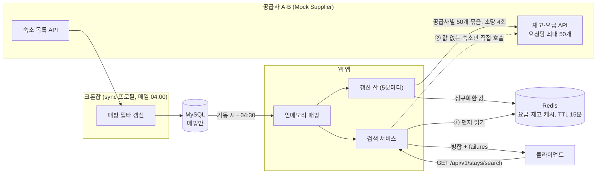
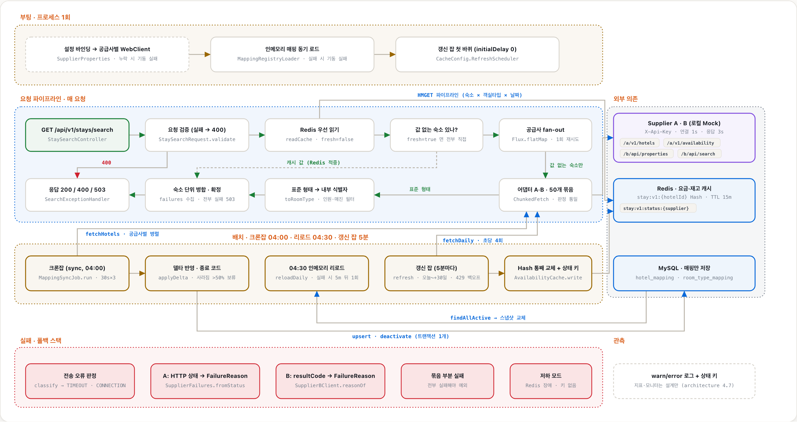

# stay-supplier-integration

여러 외부 숙박 공급사의 상품을 자사 표준 숙박 상품 모델로 통합하고, 날짜·인원 검색 한 번으로 어느 공급사 상품이든 같은 형태로 돌려주는 연동 백엔드예요. 공급사 A·B는 이 저장소의 Mock Supplier가 대신해요.

Java 21 · Spring Boot 4.0 · Spring MVC + WebClient · MyBatis + MySQL 8.4 · Redis 7.4 · Gradle Kotlin DSL

## 1. 빠른 시작

JDK 21과 Docker가 필요해요. JDK는 mise를 쓰면 `mise trust && mise install`로 받을 수 있어요.

```bash
docker compose up -d                                        # MySQL + Redis
./gradlew :mock-supplier:bootRun                            # 터미널 2: Mock Supplier (9090)
./gradlew :bootRun --args='--spring.profiles.active=sync'   # 처음 한 번: 매핑 갱신 잡 1회 실행 후 종료
./gradlew :bootRun                                          # 터미널 3: 애플리케이션 (8080)
curl 'http://localhost:8080/api/v1/stays/search?checkIn=2026-09-20&checkOut=2026-09-23&adults=2&children=0'
./gradlew build                                             # 테스트 (Docker 필요)
```

## 2. 무엇을 만들었나

| 항목 | 상태 | 핵심 | 명세 |
|---|---|---|---|
| ① 표준 숙박 상품 모델 + 매핑 저장 | 구현 | 숙소 → 객실 타입 → 날짜별 재고·요금. 공급사 코드 ↔ 내부 식별자는 DB에 두고 크론잡이 매일 델타로 갱신 | [stay-model.md](docs/stay-model.md) |
| ② Supplier 어댑터 | 구현 | 공급사별 형식은 어댑터 패키지 안에만. A의 HTTP 상태와 B의 `resultCode`를 같은 실패 사유 8가지로 통일 | [architecture.md 4.1\~4.2](docs/architecture.md) |
| ③ 통합 검색 API | 구현 | 50개 묶음 병렬 조회, 연박은 날짜별 재고의 최솟값으로 판정, 예약 불가 기본 제외, 부분 실패는 `failures`로 | [stay-search-api.md](docs/stay-search-api.md) |
| ④ 연동 견고성 | 구현 | 연결 1초·응답 3초, 한 공급사가 죽어도 나머지로 응답 | [architecture.md 4.3\~4.4](docs/architecture.md) |
| ⑤ Mock Supplier | 구현 | 정상·장애·무응답 모드를 API로 전환 | [architecture.md 5장](docs/architecture.md) |
| 요금·재고 캐시 (선택) | 구현 | Redis에 5분마다 미리 채우고 검색은 Redis 우선. 비어 있으면 직접 호출 | [architecture.md 4.8](docs/architecture.md) |
| 재시도 (선택) | 구현 | 크론잡 고정 30초 × 3회, 검색 즉시 1회, 갱신 잡 429 지수 백오프 | [architecture.md 4.6](docs/architecture.md) |
| 정규화 실패 격리 (선택) | 부분 | 깨진 항목만 버리고 원인과 함께 로그. 격리 저장소는 없음 | [architecture.md 4.1](docs/architecture.md) |
| 연동 지표·모니터, 서킷 브레이커, 갱신 잡의 다중 팟 배치 | 설계만 | 지표 정의, 알림 규칙, 한도 탐색 절차, 갱신 잡 리더 선출. 코드에는 실패 로그만 있고 갱신 잡은 팟 하나 기준 | [architecture.md 4.6\~4.7](docs/architecture.md) |

## 3. 어떻게 동작하나



매핑은 크론잡이 하루 한 번 MySQL에 저장하고, 요금·재고는 갱신 잡이 5분마다 Redis에 채우며, 검색은 Redis를 먼저 읽고 값이 없는 숙소만 공급사를 불러요. 단계별 기본·대안 흐름은 [architecture.md 3장](docs/architecture.md)에, 노드별 코드 출처와 스토리 재생은 [인터랙티브 로직 지도](https://mjkang4416.github.io/stay-supplier-integration/system-story.html)에 있어요. 아래 그림을 클릭해도 열려요.

[](https://mjkang4416.github.io/stay-supplier-integration/system-story.html)

## 4. 설계 결정

결정마다 설계 → 이유 → 검토한 대안과 반려 이유 순서로 적어요. 선택지 비교의 전체 과정은 [JOURNAL.md](JOURNAL.md)의 "설계 의사결정 기록"에 있어요.

### 4.1 표준 숙박 상품 모델

단위는 숙소 → 객실 타입 → 날짜별 재고·요금이에요. 어댑터가 공급사 응답을 이 단위로 바꾸고, 식별자는 공급사 코드 그대로 두며 내부 식별자는 아래 매핑 테이블이 붙여요. 규칙은 4.2에 있어요.

**매핑 테이블**: MySQL, 공급사 코드 ↔ 내부 식별자

| 테이블 | 공급사 쪽 유니크 키 | 내부 식별자 | 같이 저장하는 것 |
|---|---|---|---|
| `hotel_mapping` | `(supplier, supplier_hotel_code)` | `id` 자동 증가 | `hotel_name`, `active`, `created_at`, `updated_at` |
| `room_type_mapping` | `(hotel_id, supplier_room_type_code)` | `id` 자동 증가 | `room_type_name`, `max_occupancy` NULL 허용, `active`, `created_at`, `updated_at` |

**살린 정보**

| 정보 | 표준 모델 | Supplier A | Supplier B |
|---|---|---|---|
| 숙소 코드·이름 | `hotelCode`, `hotelName` | `hotelCode`, `hotelName` | `propertyId`, `propertyName` |
| 객실 타입 코드·이름 | `roomTypeCode`, `roomTypeName` · 숙소 안에서만 유일 | `roomTypeCode`, `roomTypeName` | `roomId`, `roomName` |
| 최대 수용 인원 | `maxOccupancy` · 성인+아동 합산, 없으면 미상 | `maxOccupancy` | `maxOccupancy` |
| 재고 | `availableRooms` = 기간 내 날짜별 재고의 최솟값 | `dailyRates[].remainingRooms` · 날짜별 | `inventory[].remainingRooms` · 날짜별 |
| 요금 | `totalPrice` 세금 포함 총액 + `currency` | `nightlyRate` + `taxAmount` · 날짜별, 세금 별도 | `totalPrice` · 기간 총액, 세금 포함 |
| 조식 포함 여부 | `breakfastIncluded` | `breakfastIncluded` | `breakfastIncluded` |
| 통화 | `currency` · ISO 4217, 금액은 최소 단위 정수 | `currency` | `currency` |

**버린 정보**
- A: 날짜별 단가와 세금 내역. 총액으로 합쳐져요.
- B: `resultCode`·`resultMessage`는 실패 판정에만 쓰고, `taxIncluded`는 항상 true라 뺐어요.
- 공급사 원본 응답은 어디에도 저장하지 않아요.

**요금 기준**
- 설계: 세금 포함 총액, 즉 고객 결제 금액 하나로 통일해요. A는 날짜별 (nightlyRate + taxAmount)의 합, B는 totalPrice 그대로예요. 캐시에는 세금 포함 1박 값을 둬요.
- 이유: B는 세금 금액을 따로 주지 않아서, 두 공급사가 공통으로 만들 수 있는 값이 결제 금액뿐이에요.
- 대안과 반려 이유: 세금 별도 표기는 B에서 세금을 만들 수 없어 반려했어요. 날짜별 단가를 그대로 노출하는 안은 B가 기간 총액만 줘서 통일이 안 돼 반려했어요. 그 대가로 A의 세금 내역과 날짜별 단가는 응답에서 사라져요.

**재고 표현과 최대 인원**
- 설계: 날짜별 `remainingRooms`를 그대로 받아 기간의 최솟값을 `availableRooms`로 내요. 0이면 예약 불가예요. 최대 인원은 공급사가 안 주면 미상으로 저장하고, 검색 응답에서는 재고·요금 응답 값 → 매핑 값 순으로 채우며 둘 다 없으면 그 객실 타입을 빼요.
- 이유: 두 공급사 모두 날짜별 정수 재고를 줘서 변환 없이 같은 단위예요. 최대 인원은 응답 계약상 필수라 추측한 기본값으로 인원 필터를 돌리지 않으려고 미상을 따로 뒀어요.
- 대안과 반려 이유: 처음 초안은 최대 인원이 없는 객실 타입을 아예 저장하지 않는 것이었는데, 인원만 모르는 상품까지 검색에서 사라져서 미상으로 저장하는 쪽으로 바꿨어요.

### 4.2 매핑

**무엇을 저장하고 언제 갱신하나**
- 설계: 자주 안 바뀌는 숙소·객실 타입 매핑만 MySQL에 저장하고 자주 바뀌는 재고·요금은 저장하지 않아요. 갱신은 K8s CronJob이 매일 04:00 Asia/Seoul에 `sync` 프로필의 별도 팟으로 돌려 추가·변경·사라짐 델타만 반영하고, 웹 앱은 기동 시와 04:30에 DB에서 인메모리로 읽어요. 공급사 하나가 실패하면 그 공급사만 건너뛰고 기존 매핑을 유지해요. 같은 공급사 코드는 유니크 키와 upsert로 항상 같은 내부 식별자를 받고, 사라진 숙소는 행을 지우지 않고 `active`만 내려서 돌아와도 같은 식별자예요. 규칙은 [stay-model.md 3장](docs/stay-model.md)에 있어요.
- 이유: 숙소 정보는 일·주 단위, 요금·재고는 시간 단위로 바뀌어요. 크론잡의 쓰기와 웹 앱의 읽기를 프로세스로 나누면 인스턴스가 여러 대여도 갱신은 한 곳에서만 일어나고 웹 앱은 공급사 장애와 무관하게 기동해요. 04:00은 일반 웹 트래픽의 최저 시간대인 03\~05시를 기준으로 잡았어요.
- 대안과 반려 이유: 검색할 때마다 숙소 목록도 호출하는 안은 자주 안 바뀌는 전체 목록을 매번 받고 식별자 안정성을 보장하지 못해요. 재고·요금까지 DB에 저장하는 안은 이벤트마다 바뀌는 값이라 항상 옛 값이 돼요. 기동 시에만 갱신하는 안은 운영 중 추가된 숙소가 재기동 전까지 안 보여요. 웹 앱 안의 `@Scheduled` 갱신은 인스턴스가 여러 대면 락이 필요하고 웹 앱이 공급사 실패의 영향을 받아요. 수동 갱신 엔드포인트는 운영 API 표면과 인증 문제가 늘어요. 갱신 사이에 추가된 숙소가 최대 하루 늦게 보이는 건 받아들였어요.

### 4.3 Supplier 어댑터

**경계와 실패 판정**
- 설계: 공통 인터페이스 `SupplierClient` 하나로 호출하고 응답을 표준 형태로 바꿔 돌려줘요. 공급사 전용 응답 형식은 공급사 패키지 안에만 있어요. 실패는 A의 HTTP 상태 코드와 B의 `resultCode`를 같은 `FailureReason` 8가지로 바꿔 `SupplierCallException` 하나로 던져요. 여덟 가지는 잘못된 요청, 인증 실패, 한도 초과, 공급사 오류, 일시 장애, 타임아웃, 연결 실패, 깨진 응답이에요. 어댑터는 공급사 API 호출과 표준 형태로의 번역까지만 해요. 저장·병합·캐시·재시도는 어댑터를 부르는 서비스가 해요. 크론잡 `MappingSyncJob`은 DB에 저장하고, 갱신 잡 `AvailabilityRefreshJob`은 Redis에 넣고, 검색 `StaySearchService`는 응답으로 병합해요.
- 이유: B는 장애여도 HTTP 200을 줘서 본문 코드를 안 읽으면 장애를 정상으로 처리해요. 원인을 하나의 목록으로 모아야 크론잡·갱신 잡·검색이 재시도와 알림 규칙을 공급사와 무관하게 쓸 수 있어요.
- 대안과 반려 이유: 서비스에서 WebClient를 직접 부르고 JSON을 Map으로 읽는 안은 A·B 분기가 서비스에 퍼져요. A·B 필드를 모두 담은 공통 DTO는 절반이 항상 null이에요. `switch (supplier)` 분기는 공급사마다 switch를 고쳐야 해요. 실패를 결과 객체로 반환하는 안은 타임아웃·5xx가 예외로 와서 어댑터마다 변환을 반복해요. 어댑터가 저장까지 하는 안은 세 서비스의 저장 방식이 달라 어댑터가 셋을 다 알아야 해서 반려했어요.

**신규 Supplier 추가 시 수정 범위**
- 설계: `Supplier` enum 값, `supplier/c` 패키지와 그 안의 클라이언트·전용 응답 형식·실패 판정 규칙, `supplier.endpoints.c.*` 설정, WireMock 테스트를 추가해요. 크론잡·매핑 테이블·검색 서비스·표준 형태·WebClient 구성은 건드리지 않아요. 절차는 `.claude/skills/add-supplier`에 있어요.
- 이유: 호출하는 쪽이 인터페이스와 표준 형태만 보기 때문에 새 공급사가 패키지 하나로 끝나요. 설정을 빠뜨리면 기동 시 바로 실패해서 누락이 운영에서 드러나지 않아요.

### 4.4 통합 검색 API

**연박 예약 가능 객실 수**
- 설계: 체크인일부터 체크아웃 전날까지의 날짜별 `remainingRooms` 중 최솟값이에요. 0이면 예약 불가예요.
- 이유: N박은 같은 객실 타입을 N일 연속으로 잡아야 해서 하루라도 0이면 통째로 예약할 수 없어요. 응답이 객실 타입 단위고 호실이 없어 이 이상의 판정은 할 수 없어요.
- 대안과 반려 이유: 하루가 비는 날 다른 객실 타입으로 대체하는 업그레이드·분할 예약 판매는 각 객실 타입을 독립 상품으로 보는 응답 계약과 맞지 않아 다루지 않았어요.

**예약 불가 상품**
- 설계: 예약 가능 객실 수가 0인 객실 타입은 응답에서 빼고, 객실 타입이 모두 빠진 숙소도 빼요. `includeSoldOut=true`면 0으로 포함해요.
- 이유: 이 API는 앱 백엔드가 쓰는 집계 API고 프론트엔드는 비범위라, 예약 가능한 객실만 돌려주는 Expedia Rapid 같은 공급사·집계 API 관행을 따랐어요. 매진 노출은 화면의 마케팅 판단이라 옵션으로 넘겼어요.
- 대안과 반려 이유: 소비자용 OTA 앱 화면처럼 매진 상품도 항상 0으로 보여주는 안을 검토했어요. 매진 노출은 방이 얼마 안 남았다는 희소성을 연출하는 마케팅 장치라 화면이 정할 일이고, 백엔드 집계 API의 기본값으로는 예약 가능한 상품만 주는 쪽이 맞아 반려했어요. 다만 캐시에는 재고 0도 저장해요. 연박 판정에서 하루가 0인 걸 알아야 하고, `includeSoldOut=true`일 때 보여줘야 하기 때문이에요.

**부분 실패 표현**
- 설계: 일부 공급사가 실패하면 200 + 성공한 결과 + `failures: [{ supplier, reason, affectedHotels }]`, 전부 실패하면 503 + `Retry-After: 5`, 잘못된 요청은 400이고 공급사를 부르지 않아요.
- 이유: 클라이언트가 결과를 그대로 쓰고 실패 사실은 필드로 드러나요.
- 대안과 반려 이유: 206·207 같은 부분 성공 상태 코드는 대부분의 클라이언트가 오류로 처리해서 반려했어요. 두 공급사가 모두 실패했을 때 200에 빈 목록을 주는 안은 "그 날짜에 예약 가능한 숙소가 없다"는 정상 응답과 구분이 안 돼서, 503과 `Retry-After`로 장애임을 알리기로 했어요.

**대량 숙소 조회**
- 설계: 어댑터가 요청당 50개인 공급사 한도를 알고 안에서 잘라 병렬 호출해요. 평소 검색은 미리 채운 Redis만 읽어 숙소 수와 무관하게 ms고, Redis가 비었을 때만 직접 호출하며 호출 예산은 공급사당 초당 4회이고 설정값이에요.
- 이유: 초당 한도가 스펙에 없고 실제 공급사 공개값이 0.8\~10회예요. 1,000개를 3초 안에 훑으려면 초당 8회가 필요해 호출 속도로는 풀리지 않고, 검색 응답이 3초를 넘기면 이탈이 급증해요. 캐시가 완전히 비는 건 Redis 장애뿐인 예외라 그때 5초 복구를 받아들였어요.
- 대안과 반려 이유: 초당 8회로 시작하는 안은 평소 429 위험을 키워서 반려했어요. 3초를 넘긴 숙소를 `pending`으로 표시하는 부분 응답과 날짜 거리별 갱신 주기 계층은 5,000개부터 필요해서 확장 설계로만 남겼어요.

### 4.5 연동 견고성

**타임아웃**
- 설계: 연결 1초, 응답 3초예요. 공급사별 설정값 `supplier.endpoints.{a|b}.connect-timeout`과 `response-timeout`으로 바꿀 수 있고 WebClient에 미리 적용해요.
- 이유: 연결은 같은 리전이면 수십 ms라 1초를 넘으면 네트워크 문제로 봐요. 응답은 사용자가 기다리는 검색이고 병렬 호출의 전체 지연은 가장 느린 공급사로 정해져서, 3초에 끊고 나머지로 응답해요. 느린 공급사의 정상 응답을 3초에 끊는 손해는 설계만 한 p95 지연 모니터로 값을 재검토해 보완해요.

**재시도**
- 설계: 크론잡은 연결 실패·타임아웃·공급사 오류·일시 장애·한도 초과를 고정 30초 간격으로 3회, 검색은 연결 실패·공급사 오류·일시 장애만 200ms 뒤 1회, 갱신 잡은 429 한도 초과만 1→2→4초로 늘어나는 지수 백오프로 최대 5회, 60초 상한까지 재시도해요. 잘못된 요청·인증 실패·깨진 응답은 어디서도 재시도하지 않아요.
- 이유: 같은 실패라도 새벽 배치는 기다릴 수 있고 사용자 요청은 기다릴 수 없어요. 429는 더 기다려야 풀리는 실패라 간격을 늘려요. 검색에서 타임아웃을 재시도하면 3초를 두 번 써서 뺐어요.
- 대안과 반려 이유: 크론잡에도 지수 백오프를 쓰는 안은 새벽 배치에서 간격을 늘려 얻는 게 없어 고정 간격으로 했어요. 검색 재시도 횟수를 늘리는 안은 사용자 대기 시간이 늘어 반려했어요.

**외부 연결 실패 알림과 서킷 브레이커 (설계만)**
- 설계: 공급사·DB·Redis 연결 실패는 1건 이상이면 알리고, 같은 대상·원인은 5분 창에서 묶으며, 비율이 임계를 넘으면 긴급으로 올려요. 근거는 실패마다 남기는 공급사·원인·원본 코드 로그예요. 서킷 브레이커는 반복 실패 공급사를 끊는 조건과 복구 조건만 정했어요.
- 이유: 부분 실패를 허용하는 설계일수록 실패가 응답에서 가려져서 알림으로 보완해요.
- 대안과 반려 이유: 지표 코드와 모니터를 저장소에 넣는 안은 외부 SaaS 설정이라 저장소에서 재현되지 않아 설계로만 남겼어요. 서킷 브레이커, 즉 계속 실패하는 공급사를 잠시 부르지 않다가 나중에 다시 시도하는 장치는 안내서가 선택 항목으로 둔 것이라, 필수인 병렬 호출·타임아웃·부분 실패·실패 판정 통일을 먼저 구현하고 끊는 조건과 복구 조건만 설계로 남겼어요.

### 4.6 요금·재고 캐시
- 설계: Redis 공유 캐시에 미리 채워요. 웹 앱의 갱신 잡이 5분마다 인메모리 매핑의 숙소를 공급사별 50개 묶음으로 조회해 숙소당 Hash에 통째로 교체해 올려요. 키는 `stay:v1:{hotelId}`, 필드는 `{roomTypeId}:{yyyyMMdd}`, 값은 `재고|세금 포함 1박|통화|조식|최대 인원`이에요. 창은 오늘부터 30일, TTL은 주기의 3배인 15분, 호출 속도는 공급사당 초당 4회이고 429를 받으면 절반으로 줄여요. 검색은 Redis를 먼저 읽고 값이 없는 숙소만 직접 호출하며, `fresh=true`면 전부 직접 호출해요. 요금·재고는 DB에 저장하지 않아요. B는 기간 총액만 줘서 캐시에는 1박 값을 저장하고 연박 요금은 1박 값의 합으로 계산해요. B가 연박 할인을 걸면 실제와 달라질 수 있어 예약 직전 `fresh=true` 재확인으로 보정해요.
- 이유: 인스턴스별 캐시는 여러 대일 때 효과가 희석되고 공급사 호출이 대수만큼 늘어요. 키 하나의 변경 간격은 요금 30분\~2시간, 재고 1.6\~5시간이라 분 단위인 인기 키의 검색 간격보다 길어 캐시가 성립하고, 5분 지연은 예약 직전 `fresh=true` 재확인으로 흡수해요.
- 대안과 반려 이유: 서버 시작 시 한 번 캐싱은 재고가 이벤트마다 바뀌어 곧 틀려요. 인스턴스별 인메모리 캐시는 값이 인스턴스마다 다르고 호출이 중복돼요. 검색 시점에 채우는 캐시 어사이드는 새 기간을 처음 검색한 사용자가 초 단위를 기다려요.

### 4.7 Spring MVC 위에서 WebClient만 쓴 이유
- 설계: Spring MVC 위에서 공급사 호출에만 WebClient를 써요. 병렬 호출은 Reactor 체인 `Flux.flatMap`으로 만들고 끝에서 한 번 `block()`해요. 가상 스레드는 켜지 않아요.
- 이유: 병렬·타임아웃·부분 실패가 필요한 곳은 공급사 호출뿐이고, MyBatis·크론잡·인메모리 조회는 블로킹이에요.
- 대안과 반려 이유: WebFlux 전면 전환은 MyBatis와 맞지 않고 얻는 것보다 복잡도가 커서 반려했어요. 가상 스레드는 블로킹 클라이언트로 병렬을 만들 때 유용한데 WebClient가 논블로킹이라 필요가 없어요. 검색 요청 스레드 하나가 `block()`으로 대기하는 건 QPS가 매우 높아지면 `spring.threads.virtual.enabled`로 재검토해요.

## 5. 실행 상세

### 알아둘 것
- 기본 포트는 앱 8080, Mock 9090, MySQL 3306, Redis 6379예요. 겹치면 MySQL은 `MYSQL_PORT=3307 docker compose up -d`와 앱 `DB_PORT=3307`, Redis는 `REDIS_PORT=6380`이고 앱도 같은 변수를 읽어요. 앱은 `./gradlew :bootRun --args='--server.port=8081'`로 바꿔요.
- 처음 띄울 때는 매핑 테이블이 비어 있으니 `sync` 프로필 갱신 잡을 한 번 돌린 뒤 애플리케이션을 띄워요. 공급사 하나라도 실패하면 종료 코드 1로 끝나요.
- 애플리케이션은 기동 직후 오늘부터 30일치 요금·재고를 Redis에 채우는 데 약 10초가 걸리고, 그 뒤 5분마다 다시 채워요.
- 모듈이 둘이라 본 앱은 `:bootRun`, Mock은 `:mock-supplier:bootRun`으로 지정해요.
- Swagger UI는 애플리케이션이 떠 있을 때 http://localhost:8080/swagger-ui.html 에서 열려요.
- MySQL 초기화는 `docker compose down -v`, Redis 캐시 확인은 `docker compose exec redis redis-cli KEYS 'stay:v1:*'`예요.

### 동작 확인
Mock은 요청한 날짜 범위대로 3일 패턴을 반복해 응답해요. 캐시 창이 오늘부터 30일이라 그 안의 날짜를 써요. 아래 날짜가 지났으면 내일부터 3박으로 바꿔요.
```bash
Q='http://localhost:8080/api/v1/stays/search?checkIn=2026-09-20&checkOut=2026-09-23&adults=2&children=0'
curl -s "$Q"                                                            # 1. 캐시 적중: "fresh": false, 수 ms. Riverside A(429,000)·B(452,000). Namsan은 하루 재고 0이라 제외
docker compose exec redis redis-cli FLUSHALL                             # 2. 캐시를 비워요 (TTL 만료·Redis 초기화와 같은 상태)
curl -s "$Q"                                                            #    저하 모드: "fresh": true, 공급사 직접 호출, 같은 값
curl -s -X POST 'http://localhost:9090/control/a/mode?value=error'      # 3. Supplier A 장애 (캐시가 비어 있으니 검색이 직접 호출)
curl -s "$Q"                                                            #    200 + failures: [{ "supplier": "A", "reason": "UNAVAILABLE" }], B 결과만
curl -s -X POST 'http://localhost:9090/control/a/mode?value=no-response' # 4. Supplier A 무응답
curl -s "$Q"                                                            #    3초 뒤 200 + failures: [{ "supplier": "A", "reason": "TIMEOUT" }]
curl -s -X POST 'http://localhost:9090/control/b/mode?value=error'      # 5. B도 장애 → 전부 실패
curl -s -i "$Q"                                                         #    503 + Retry-After: 5
curl -s -X POST 'http://localhost:9090/control/a/mode?value=normal'     # 6. 복구. 다음 갱신 바퀴(최대 5분)부터 다시 캐시 적중
curl -s -X POST 'http://localhost:9090/control/b/mode?value=normal'
curl -s "$Q&includeSoldOut=true"                                        # 7. 예약 불가(Namsan, availableRooms 0)도 포함
curl -s "$Q&fresh=true"                                                 # 8. 캐시가 있어도 공급사에 직접 물어요 (예약 직전 재확인)
```

크론잡의 실패 처리는 Mock을 내린 채 `./gradlew :bootRun --args='--spring.profiles.active=sync'`를 돌리면 볼 수 있어요. 로그에 `mapping sync retry supplier=A attempt=1..3`이 30초 간격으로 찍힌 뒤 `mapping sync skipped supplier=A reason=CONNECTION (existing mapping kept)`와 `exitCode=1`이 나오고, `hotel_mapping`의 행은 그대로예요.

## 6. 문서
- [docs/architecture.md](docs/architecture.md): 아키텍처. 전체 구성, 유스케이스, 공급사 연동, Mock Supplier, 실행·테스트 구성
- [docs/stay-model.md](docs/stay-model.md): 통합 모델 설계. 표준 모델, 공급사 필드 대응, 매핑
- [docs/stay-search-api.md](docs/stay-search-api.md): API 명세
- [docs/domain-research.md](docs/domain-research.md): 도메인 리서치 원페이저. 공급사 구조, 공급사 간 표현 차이
- [docs/system-story.html](https://mjkang4416.github.io/stay-supplier-integration/system-story.html): 인터랙티브 로직 지도. 존·노드·스토리 재생, GitHub Pages로 열려요
- [JOURNAL.md](JOURNAL.md): 설계 의사결정 기록, 진행 기록, 테스트 전략과 결과, AI 활용 기록
