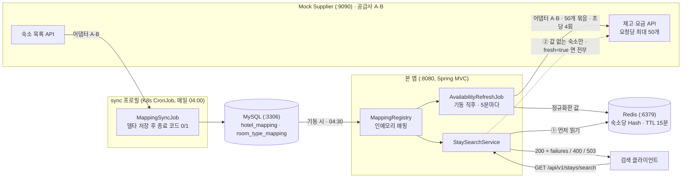

# 아키텍처

> 확정된 설계를 명세해요. 결정의 근거는 [README.md](../README.md) 4장, 결정 과정은 [JOURNAL.md](../JOURNAL.md)에 있어요.

## 1. 전체 구성



공급사 호출은 전부 어댑터 A·B를 거쳐요. 어댑터는 WebClient로 `X-Api-Key` 헤더를 붙여 부르고, 연결 1초·응답 3초 타임아웃과 공급사당 초당 4회 예산을 적용해요. 크론잡은 같은 이미지를 `sync` 프로필로 띄운 별도 프로세스예요. 노드를 눌러 코드 출처와 상수를 볼 수 있는 [인터랙티브 로직 지도](https://mjkang4416.github.io/stay-supplier-integration/system-story.html)도 있어요. 원본은 `docs/system-story.html`이에요.

- 호출 방향은 항상 본 앱 → 바깥이에요. 공급사·MySQL·Redis는 본 앱을 호출하지 않아요.
- 요금·재고는 TTL이 있는 Redis 캐시와 응답에만 있고 MySQL에는 매핑만 있어요.
- 검색이 공급사를 직접 부르는 것은 Redis에 값이 없는 숙소와 `fresh=true`뿐이에요.

## 2. 모듈·패키지 구조

### 2.1 모듈

| 모듈 | 역할 | 포트 | 진입점 |
|---|---|---|---|
| 루트 `:` | 본 애플리케이션. 프로필로 역할을 나눠요: 기본 = 웹 앱으로 검색 API와 인메모리 매핑 담당, `sync` = 매핑 갱신 잡을 웹 서버 없이 1회 실행 후 종료 | 8080 | `StaySupplierIntegrationApplication` |
| `:mock-supplier` | 공급사 A·B를 흉내 내는 Mock 서버 | 9090 | `MockSupplierApplication` |

- 두 모듈은 서로 코드를 참조하지 않아요. Mock은 외부 시스템을 흉내 내는 것이므로 본 앱의 DTO를 공유하지 않아요.
- 한 저장소에 두는 이유는 같이 빌드·관리하고 평가자가 한 번에 받기 위해서예요. 실행 시점에는 별개 프로세스예요.

### 2.2 패키지

기능별로 나눠요. controller/service/repository 계층별로 나누면 공급사별 DTO가 한 폴더에 섞여 경계가 흐려져요.

| 패키지 | 책임 | 의존하는 곳 |
|---|---|---|
| `supplier` | `SupplierClient` 인터페이스, `Supplier` enum, 설정 `SupplierProperties`, 공급사별 WebClient `SupplierWebClients`, 호출 예산 `SupplierRateLimiter`, 실패 판정 통일 `FailureReason`·`SupplierCallException`·`SupplierFailures`, 묶음 처리 `ChunkedFetch` | `stay` |
| `supplier.a`, `supplier.b` | 공급사별 어댑터와 package-private 전용 응답 형식. 호출과 번역까지만 | `supplier`, `stay` |
| `stay` | 어댑터 밖으로 나가는 표준 형태. `SupplierHotel`, `SupplierRoomType`, `SupplierRoomOffer`, `SupplierDailyOffer`, `AvailabilityQuery`, 결과 묶음 | 없음 |
| `mapping` | 매핑 엔티티·MyBatis 매퍼, 크론잡 `MappingSyncJob`·`MappingSyncRunner`, 인메모리 `MappingRegistry`·`MappingRegistryLoader` | `supplier` 인터페이스, `stay` |
| `cache` | 요금·재고 캐시 `AvailabilityCache`·`CachedRate`와 갱신 잡 `AvailabilityRefreshJob` | `supplier` 인터페이스, `stay`, `mapping` 레지스트리 |
| `search` | 검색 API의 컨트롤러·서비스·요청·응답·오류 응답 | `supplier` 인터페이스, `stay`, `mapping` 레지스트리, `cache` |
| `config` | 설정 바인딩과 빈 등록. `SupplierClientConfig`, `MappingConfig`, `CacheConfig`, `SchedulingConfig` | 전부 |

의존 방향은 `search`·`cache`·`mapping` → `supplier` 인터페이스·`stay`이고, 공급사 구현 패키지 `supplier.a`·`supplier.b`를 참조하는 곳은 `config`뿐이며 그마저도 컴포넌트 스캔으로 찾아요. 새 공급사는 `supplier/c`를 더하면 되고 위 패키지는 바뀌지 않아요.

### 2.3 코드 읽는 순서

핵심 흐름 순이에요.
1. `search/StaySearchService` - 검색 한 건이 Redis → 공급사 직접 호출 → 병합으로 흐르는 전체 그림. `StaySearchController`, `SearchExceptionHandler`가 입구와 오류 응답
2. `supplier/SupplierClient` → `supplier/a/SupplierAClient`, `supplier/b/SupplierBClient` - 공급사 호출과 표준 형태로의 번역. `SupplierFailures`·`FailureReason`이 실패 판정 통일, `ChunkedFetch`가 50개 묶음과 부분 실패, `SupplierWebClients`·`SupplierRateLimiter`가 타임아웃·헤더·호출 예산
3. `mapping/MappingSyncJob` - 크론잡의 델타 반영. `MappingRegistry`·`MappingRegistryLoader`가 인메모리, `MappingSyncRunner`가 sync 프로필 종료 코드
4. `cache/AvailabilityRefreshJob` → `AvailabilityCache` - 요금·재고를 Redis에 미리 채우는 쪽과 저장 형식 `CachedRate`
5. `mock-supplier/.../MockSupplierController` - 공급사 대역과 장애 모드

## 3. 유스케이스와 핵심 흐름

### 3.1 UC-1 매핑 생성·갱신

- 목적: 공급사의 숙소·객실 타입 코드를 내부 식별자에 대응시켜 저장해요.
- 트리거: 매일 04:00 Asia/Seoul에 K8s CronJob이 `sync` 프로필로 1회 실행해요. 로컬은 `./gradlew :bootRun --args='--spring.profiles.active=sync'`예요. 웹 앱은 매핑을 만들지 않고 기동 시와 04:30에 DB에서 읽어요. 결정 근거는 README 4.2
- 기본 흐름
  1. 공급사별 숙소 목록 API를 호출해요.
  2. 숙소마다 공급사와 숙소 코드 조합에 대한 내부 숙소 식별자를 확보해요. 이미 있으면 재사용해요.
  3. 객실 타입마다 공급사·숙소 코드·객실 타입 코드 조합에 대한 내부 객실 타입 식별자를 확보해요.
  4. 공급사별 건수와 실패 여부를 기록해요.
- 대안 흐름
  - A1 공급사 숙소 목록 조회 실패: 일시 장애는 고정 30초 × 3회 재시도, 그래도 실패면 해당 공급사만 건너뛰고 기존 매핑 유지. 잡은 종료 코드 1로 끝나 K8s가 backoffLimit 2로 재실행
  - A2 재실행: 같은 코드는 같은 내부 식별자로 돌아와야 해요.
  - A3 공급사 목록에서 사라진 숙소: `active=false`로 비활성, 행은 삭제하지 않음. 직전 active의 절반 넘게 사라지면 공급사 쪽 장애로 보고 비활성화만 보류하고 알림
  - A4 동시 실행: 식별자가 중복 생성되지 않아야 해요.

### 3.2 UC-2 통합 검색

- 목적: 날짜·인원으로 보유 숙소 전체의 예약 가능 객실과 요금을 하나의 형태로 돌려줘요.
- 트리거: `GET /api/v1/stays/search`
- 사전 조건: 매핑이 저장되어 있어요.
- 기본 흐름
  1. 날짜 순서와 인원을 검증해요.
  2. 인메모리 매핑의 보유 숙소 전체에 대해 Redis에서 객실 타입 × 숙박일 값을 읽어요. 값이 있는 숙소는 여기서 끝나요.
  3. 값이 없는 숙소만, `fresh=true`면 전부를 공급사별 코드 묶음으로 나눠 재고·요금 API를 병렬 호출해요. 요청당 50개 묶음, 연결·응답 타임아웃, 호출 예산이 적용돼요.
  4. 응답을 표준 모델로 정규화하고 공급사별로 실패를 판정해요.
  5. 요청 기간 전체의 예약 가능 객실 수를 판정해요.
  6. 공급사별 결과를 병합하고, 부분 실패 사실을 담아 응답해요.
- 대안 흐름
  - A1 잘못된 요청, 예를 들어 체크아웃이 체크인보다 빠르거나 같거나 인원이 0: 400 응답
  - A2 일부 공급사 장애 응답, HTTP 4xx·5xx 또는 HTTP 200 + 실패 코드: 해당 공급사를 제외하고 부분 실패로 표시
  - A3 일부 공급사 무응답: 타임아웃 뒤 A2와 같이 처리
  - A4 캐시에서 읽은 숙소가 하나도 없는 상태에서 모든 공급사 실패: 503 + `Retry-After: 5` + `failures`. 빈 200은 "예약 가능한 숙소 없음"으로 오해되므로 구분
  - A5 기간 중 하루라도 재고 0: 예약 불가. 기본은 응답에서 제외, `includeSoldOut=true`면 `availableRooms: 0`으로 포함
  - A6 매핑이 비어 있어 보유 숙소 없음: 빈 결과
  - A7 응답 정규화 실패: 항목 하나의 필드 누락은 그 항목만 제외하고 로그를 남겨요. `maxOccupancy` 누락은 미상으로 살려요. `items`나 `data`가 없거나 모르는 `resultCode`처럼 본문 구조 자체가 깨졌으면 그 공급사의 실패 `INVALID_RESPONSE`로 처리
  - A9 Redis에 값이 없거나 Redis 장애: 값이 없는 숙소만, 장애면 전부를 공급사에 직접 호출하는 저하 모드로 가고 `fresh: true`로 표시. 값이 없는 경우는 갱신 잡 첫 바퀴 전, 요청 날짜가 오늘\~+30일 캐시 창 밖, 키 만료예요. 갱신 잡의 마지막 시도가 실패한 공급사는 `failures`에 표시
  - A8 보유 숙소가 요청당 상한을 넘음: 묶음을 나눠 호출

### 3.3 UC-3 요금·재고 캐시 갱신

- 목적: 검색이 공급사를 부르지 않고 응답하도록 오늘\~+30일의 재고·요금을 Redis에 미리 채워요.
- 트리거: 웹 앱 기동 직후, 그 뒤 5분마다예요. 주기는 `cache.refresh-interval`이에요.
- 기본 흐름
  1. 인메모리 매핑에서 공급사별 active 숙소 코드를 꺼내요.
  2. 어댑터의 날짜별 조회를 호출해요. A는 기간 한 번, B는 날짜마다 1박 호출이고 adults=1로 모든 객실 타입을 받아요. 50개 묶음·호출 예산 적용.
  3. 공급사 코드를 내부 식별자로 바꿔 숙소당 Hash에 쓰고 주기의 3배인 TTL을 걸어요. 공급사별 상태 키에 성공 시각을 기록해요.
- 대안 흐름
  - A1 공급사 실패: 그 공급사만 건너뛰고 상태 키에 실패 원인·시각 기록. 값은 TTL까지 유지. 검색이 상태를 읽어 `failures`에 표시
  - A2 묶음 일부 실패: 성공한 묶음만 쓰고 실패 묶음은 로그
  - A3 매핑에 없는 코드: 버림. 다음 새벽 크론잡이 채우면 그때부터
  - A4 Redis 쓰기 실패: 이번 바퀴 실패 로그, 다음 주기에 다시. 검색은 저하 모드
  - A5 429: 백오프 뒤 그 공급사 예산을 절반으로

## 4. 공급사 연동

### 4.1 어댑터 구조와 경계

구현 상태: ① 숙소 목록 조회까지 구현. ② 재고·요금 조회는 검색 API와 함께 추가해요.

- 공통 인터페이스 `supplier.SupplierClient`: `supplier()`, `fetchHotels()`. 반환은 `Mono<List<SupplierHotel>>`이고, 호출자가 여러 공급사를 합친 뒤 끝에서 한 번 `block()`해요.
- 구현체는 공급사별 패키지에 하나씩: `supplier.a.SupplierAClient`, `supplier.b.SupplierBClient`. 공급사 전용 응답 형식 `SupplierAResponses`·`SupplierBResponses`는 package-private라 그 패키지 밖에서 참조할 수 없어요.
- 어댑터 밖으로 나가는 형태는 `stay.SupplierHotel`, `stay.SupplierRoomType`, `supplier.FailureReason`뿐이에요. 식별자는 공급사 코드 그대로이고, 내부 식별자 배정은 매핑이 해요. 규칙은 stay-model 3장이에요.
- 어댑터의 책임은 호출과 번역까지예요. 매핑 델타 저장·병합·캐시는 서비스가 하고, 재시도도 어댑터에 없이 호출자가 `Mono`에 정책을 붙여요. 같은 어댑터를 크론잡·검색·실시간 재확인이 다른 방식으로 쓰기 때문이에요.
- WebClient는 `supplier.SupplierWebClients`가 공급사마다 하나씩 기동 시 만들어 둬요. 기본 URL, 공통 규약의 `X-Api-Key` 헤더, 연결·응답 타임아웃이 미리 적용되어 어댑터 코드에는 경로와 번역만 남아요. 설정이 빠진 공급사가 있으면 기동이 실패해요.
- 정규화 실패 격리: 식별에 필요한 숙소 코드·이름과 객실 타입 코드·이름이 빠진 항목은 그 항목만 버리고 warn 로그를 남겨요. `maxOccupancy`가 없거나 1 미만이면 객실 타입은 살리되 기본값을 넣지 않고 미상, 즉 null로 둬요. 인원 필터에 추측한 값이 들어가면 안 되기 때문이에요. 검색 응답에서는 이 값이 계약상 필수이므로 ② 응답 값 → 매핑 값 순으로 채우고, 둘 다 없으면 그 객실 타입을 응답에서 제외하고 로그·지표를 남겨요. 필드 길이는 예제 데이터 범위인 코드 100자·이름 255자로 두고 따로 검사하지 않아요.

### 4.2 실패 판정

A는 HTTP 상태 코드로, B는 항상 HTTP 200에 본문 `resultCode`로 실패를 알려요. 어댑터가 둘을 같은 `FailureReason`으로 바꾸고 `SupplierCallException(공급사, 원인, 원본 코드, Retry-After)` 하나로 던져요. 밖에서는 원인만 봐요.

| `FailureReason` | Supplier A HTTP 상태 | Supplier B `resultCode` | 공통 전송 계층 |
|---|---|---|---|
| `INVALID_REQUEST` | 400 `INVALID_DATE_RANGE`·`INVALID_PARAMETER`·`TOO_MANY_HOTEL_CODES`, 그 밖의 4xx | `E400` | |
| `UNAUTHORIZED` | 401 | `E401` | |
| `RATE_LIMITED` | 429. `Retry-After`가 초 단위면 예외에 실어요 | `E429` | |
| `SUPPLIER_ERROR` | 500, 그 밖의 5xx | `E500` | |
| `UNAVAILABLE` | 503 | `E503` | B가 스펙과 달리 HTTP 오류를 주면 A와 같은 상태 규칙으로 판정 |
| `TIMEOUT` | | | 응답 타임아웃 초과 |
| `CONNECTION` | | | 연결 거부·연결 타임아웃·DNS 실패 |
| `INVALID_RESPONSE` | 본문 파싱 실패, `items` 구조 없음 | 모르는 `resultCode`, `0000`인데 `data.items` 구조 없음 | 코덱 오류 |

"없음"은 두 종류로 나눠요. 공급사가 `items: []`로 "팔 게 없다"고 말한 것은 정상 0건이고, 성공 코드인데 `data`나 `items` 구조 자체가 없는 것은 깨진 응답이에요. 후자를 0건으로 읽으면 실제로 있는 상품이 검색에서 사라지는데 지표는 성공으로 남아 알림이 울리지 않아요. 판정 코드는 각 공급사 패키지 안에 있어요. B는 `SupplierBClient.reasonOf`, 공통 규칙은 `SupplierFailures`예요.

### 4.3 타임아웃

설정 위치는 `supplier.endpoints.{a|b}.connect-timeout` 기본 1초와 `response-timeout` 기본 3초이고, `SupplierWebClients`가 공급사별 WebClient를 만들 때 Spring Boot `HttpClientSettings`를 거쳐 reactor-netty 연결·응답 타임아웃으로 적용해요. 값의 근거는 [README 4.5](../README.md)에 있어요. 초과하면 응답은 `FailureReason.TIMEOUT`, 연결은 `CONNECTION`으로 통일돼요.

### 4.4 부분 실패 처리

구현 상태: 크론잡 경로 `MappingSyncJob`과 검색 경로 `StaySearchService` 모두 구현.

실패는 병합하기 전에 공급사 단위로 가둬요. Reactor의 `Flux.merge`·`Mono.zip`은 하나라도 에러면 전체를 에러로 끝내고 나머지를 취소하므로, 각 공급사의 `flatMap` 체인 안에서 `SupplierCallException`을 그 공급사의 실패 결과로 바꾼 뒤 `collectList()`로 모아요. 병합 뒤에서 잡으면 늦어요.

```
Flux.fromIterable(clients)
    .flatMap(client -> client.fetch(...)
        .map(items -> Result.success(client.supplier(), items))
        .onErrorResume(SupplierCallException.class, ex -> Mono.just(Result.failure(client.supplier(), ex.getReason()))))
    .collectList()   // 성공·실패가 섞인 목록. 여기서는 에러가 나올 수 없어요
    .block()
```

| 경로 | 실패한 공급사 | 나머지 |
|---|---|---|
| 크론잡 `MappingSyncJob` | 건너뛰고 기존 매핑 유지, 결과에 원인 기록, 잡은 종료 코드 1 | 델타 반영 |
| 검색 직접 호출 | `failures: [{ supplier, reason }]`에 표시. 어댑터의 묶음 일부 실패는 실패한 묶음의 숙소 수도 함께 | 200으로 응답. 전부 실패면 503 + `Retry-After` |
| Redis 갱신 잡 `AvailabilityRefreshJob` | 상태 키에 마지막 실패 원인·시각 기록. 값은 TTL까지 유지 | 검색이 상태 키를 읽어 `failures`에 마지막 실패 원인으로 표시 |

전체 지연은 가장 느린 공급사 하나이고 응답 타임아웃을 넘지 않아요. 실패한 공급사가 다른 공급사를 늦추지 않아요.

### 4.5 신규 Supplier 추가 절차

추가하는 것 세 곳:
1. `supplier.Supplier` enum에 값 추가, 예를 들어 `C`.
2. `supplier/c` 패키지에 `SupplierCClient implements SupplierClient`와 전용 응답 형식. 그 공급사의 실패 신호를 `FailureReason`으로 바꾸는 규칙도 이 패키지 안에 둬요. `@Component`면 자동으로 `List<SupplierClient>`에 들어가요.
3. `application.properties`에 `supplier.endpoints.c.base-url`, `api-key`, `connect-timeout`, `response-timeout`. 빠뜨리면 기동 시 실패해요.

수정하지 않는 것: 크론잡 `MappingSyncJob`, 매핑 테이블·매퍼, 검색 서비스, 표준 형태, `SupplierWebClients`, `SupplierFailures`. 이들은 인터페이스와 표준 형태만 봐요.

같이 추가할 것: 정규화 결과·`X-Api-Key` 전송·실패 판정·타임아웃을 검증하는 WireMock 테스트와 stay-model 2장 필드 대응표의 열 하나.

### 4.6 재시도·서킷 브레이커 (선택)

구현 상태: 크론잡 재시도는 `MappingSyncJob`과 `mapping.sync.retry-*`, 검색 재시도는 `StaySearchService`와 `search.retry-*`로 구현. 서킷 브레이커는 설계만.

재시도 정책은 어댑터가 아니라 호출자가 정해요. 사람이 기다리는지에 따라 다르기 때문이에요.

| 원인 | 크론잡 · 새벽, 사람 안 기다림 | 검색 직접 호출 · 사람 기다림 | Redis 갱신 잡 · 5분마다 |
|---|---|---|---|
| 연결 실패, 500, 503 | 고정 30초 × 3회 | 즉시 1회, 대기 0\~200ms | 다음 바퀴 |
| 타임아웃 | 고정 30초 × 3회 | 없음, 이미 3초 소진 | 다음 바퀴 |
| 429 | 위와 같음, 고정 간격. `Retry-After` 값을 대기에 쓰는 것은 확장 | 없음, 더 부르면 악화 | 지수 백오프 1→2→4→…초, 60초 상한, 최대 5회, 설정은 `cache.rate-limit-*`. 예산은 429마다 절반이고 하한은 초당 0.5회 |
| 400·401, B `resultCode` 오류, 깨진 응답 | 없음, 다시 해도 같음 | 없음 | 없음 |

잡 수준 재실행은 K8s `backoffLimit: 2`가 맡아요. 재시도 실패는 지표에 `result=retry`로 남겨요.

**서킷 브레이커 (설계만)**: 검색 직접 호출 경로와 Redis 갱신 잡처럼 호출이 잦은 곳에만 걸어요. 최근 10회 중 5회 이상 실패하면 30초 열고, 최소 호출 수는 10이에요. 그리고, 반개방에서 시험 호출 1회가 성공하면 닫아요. 열린 동안 그 공급사는 즉시 `failures: [{ supplier, reason: CIRCUIT_OPEN }]`로 표시되어 사용자가 타임아웃을 기다리지 않아요. 크론잡 목록 호출은 하루 두 번이라 걸지 않아요. 구현하면 Resilience4j `CircuitBreaker`를 WebClient 체인에 붙여요.

### 4.7 연동 지표·모니터링

구현 상태: 설계만. 지표 정의, Datadog 전송 방식, 알림 규칙, 한도 탐색 절차를 명세하고 코드에는 넣지 않았어요. 안내 문서가 이 항목을 "설계만으로도 가능"으로 두었고, 모니터 자체는 외부 SaaS 설정이라 저장소에서 재현할 수 없기 때문이에요. 코드가 남기는 것은 실패 로그(공급사·원인·원본 코드·묶음 크기)뿐이에요.

**지표** (Micrometer. 기록 위치는 `SupplierWebClients`의 ExchangeFilterFunction 한 곳으로 두어 어댑터·새 공급사 코드에 지표 코드가 들어가지 않게 해요)

| 지표 | 타입 | 태그 | 용도 |
|---|---|---|---|
| `supplier.request` | timer (건수 + p50/p95/p99) | `supplier`(A/B), `api`(hotels/availability), `result`(success 또는 `FailureReason` 소문자) | 성공률 = success / 전체, 타임아웃 비율 = timeout / 전체, 429 비율 = rate_limited / 전체, 지연 분포 |
| `search.request` | timer | `outcome`(full / partial / failed) | 부분 실패 비율, 검색 지연 |
| `mapping.sync` | counter | `supplier`, `result`(success / 원인 / db_failure), `deactivation_held`(true/false) | 크론잡 결과 |
| `mapping.reload` | counter | `result` | 웹 앱 04:30 리로드 결과 |
| `supplier.normalize` | counter | `supplier`, `result`(invalid) | 정규화 실패로 버린 항목 수 |
| `cache.refresh`, `cache.read` (설계) | counter | `supplier`, `result` | Redis 갱신·읽기 실패 |

**Datadog 전송 방식** (설계): `micrometer-registry-datadog` 의존성과 `management.datadog.metrics.export.api-key`·`step`(예: 30s) 설정만으로 Micrometer가 위 지표를 Datadog API로 밀어 넣어요. 에이전트가 있으면 `statsd` 레지스트리로 로컬 에이전트에 보내는 방식도 같아요. 공통 태그 `service`, `env`, `pod`는 `management.metrics.tags.*`로 붙여요. 로컬·테스트에서는 레지스트리를 켜지 않아요.

**알림 원칙**: 외부 연결(공급사·DB·Redis)의 실패는 원인이 무엇이든 전부 알려요. 조용히 넘어가는 실패를 두지 않아요. 알림 피로는 "같은 대상·같은 원인은 5분 창에서 하나로 묶기"로 막고, 비율이 임계를 넘으면 긴급으로 올려요.

**알림의 근거는 로그예요.** 지표를 코드에 넣지 않기로 했으므로(위 구현 상태), 실패마다 남기는 로그(공급사·원인·원본 코드·묶음 크기, warn/error 수준)를 Datadog 로그 모니터로 감시해요. 지표 레지스트리를 붙이면 아래 규칙을 메트릭 모니터로 옮겨요.

**알림 규칙** (5분 창. 임계치는 보수적으로 시작해 관측으로 조정)

| 조건 (5분 창) | 수준 | 의미 |
|---|---|---|
| 공급사 호출 실패 1건 이상 (원인 무관: 타임아웃·연결·4xx/5xx·resultCode 오류·깨진 응답) | 알림 | 외부 호출이 실패했어요. 같은 공급사·원인은 하나로 묶음 |
| 429 1건 이상 | 알림 | 호출 한도에 닿기 시작. 허용 속도·배분 조정 신호 |
| 429 비율 > 1% 또는 부분 실패 비율 > 5% | 긴급 | 고객 검색 결과가 실제로 줄고 있음 |
| 공급사 성공률 < 97% 또는 타임아웃 비율 > 2% | 긴급 | 공급사 장애 또는 타임아웃 값 부적절 |
| p95 지연 > 응답 타임아웃의 80% | 알림 | 타임아웃 임박. 값 재검토 |

**호출 한도 탐색 절차** (한도 값을 모르는 상태에서 안전하게 찾기)
1. 허용 속도 설정값을 실제 공급사가 공개한 운영 한도(공급사당 초당 4회, Hotelbeds)에서 시작해요. 공개된 한도는 초당 0.8\~10회 범위예요([domain-research 4장](domain-research.md)).
2. 429를 받으면 코드가 로그를 남기고 그 공급사의 허용 횟수를 절반으로 줄여요(429마다, 하한 초당 0.5회). 갱신 잡은 지수 백오프(1→2→4→…초, 60초 상한, 5회를 넘기면 이번 바퀴 포기)로 물러났다 다시 하고, 검색은 재시도하지 않아요. `Retry-After` 값을 대기에 쓰는 것은 확장 항목이에요.
3. 올리는 것은 자동이 아니에요. 429 알림이 일정 기간(예: 수 일) 없으면 알림을 본 사람이 설정값을 올려요(상한 초당 10회, 공개된 최댓값).
4. 찾은 값은 설정으로 고정하고, 이후에는 429 비율 모니터로 이탈만 감시해요.

**외부 연결별 알림** (공급사 외의 연결도 실패 1건 이상이면 알려요)

| 외부 연결 | 실패하면 | 로그 | 알림 |
|---|---|---|---|
| 공급사 API · 크론잡 목록 호출 | 재시도 뒤에도 실패하면 그 공급사만 건너뛰고 기존 매핑 유지, 잡은 종료 코드 1 | error: 공급사·원인 | 잡 실패 이벤트, 마지막 성공 시각이 25시간 초과 |
| 공급사 API · 검색 직접 호출 | `failures`에 표시하고 나머지로 응답 | warn: 공급사·원인·숙소 수 | 실패 1건 이상 알림, 비율 초과 시 긴급 (위 표) |
| DB · 크론잡 | 잡 실패(종료 코드 1), K8s `backoffLimit`로 재실행 | error | 잡 실패 이벤트 |
| DB · 웹 팟 기동 로드 | 기동 실패, readiness 안 올라감 → 롤아웃 중단 | error | 팟 CrashLoop·readiness 실패 |
| DB · 웹 팟 04:30 리로드 | 기존 인메모리 유지, 5분 뒤 1회 재시도 | error | 리로드 실패 1건 이상 |
| Redis · 갱신 잡 | 이번 바퀴 실패, 다음 주기에 다시 | error | 연속 2바퀴 실패 |
| Redis · 검색 읽기 | 저하 모드(공급사 직접 호출) | warn | 저하 모드 진입 1건 이상 |

**역할 구분**: 비율·추세·임계치는 모니터(예: Datadog), 정규화 실패·예상 못 한 예외처럼 한 건이라도 조사해야 하는 것은 예외 추적(예: Sentry)에 보내요. 429는 정상 운영 상황이므로 예외로 보내지 않아요. 429 모니터의 알림은 갱신 잡의 초당 호출 횟수를 조정하는 신호로만 써요(4.8).

### 4.8 요금·재고 캐시 (선택)

구현 상태: 구현(`cache/` 패키지). 갱신 잡 `AvailabilityRefreshJob`(웹 앱 스케줄, 기동 직후 + 5분마다), 저장소 `AvailabilityCache`(Redis Hash), 검색의 Redis 우선 읽기, 공급사별 호출 예산 `SupplierRateLimiter`. 설계만 남긴 것: 날짜 거리별 주기 계층, 남은 객실 ≤ 2 핫 리스트, 첫 바퀴와 readiness 연동, 팟 여러 대일 때 갱신 잡 리더 선출, 응답 예산 초과분을 `pending`으로 표시하는 부분 응답. 검토 과정은 [JOURNAL](../JOURNAL.md)의 "요금/재고 캐시" 항목에 있어요.

요구사항과의 관계: 요금·재고를 DB에 쌓지 않는다는 요구는 지켜요(캐시는 TTL이 있는 휘발성 저장이고 원본은 공급사). 안내 문서의 기본 흐름은 검색마다 공급사를 호출하는 것이고 캐시는 선택 구현(§3.3)이에요. 우리는 검색 응답 시간(수 ms) 때문에 캐시를 주 경로로 두되, 검색 시점 직접 호출 경로(병렬·타임아웃·부분 실패·실패 판정 통일)는 `fresh=true`와 저하 모드에 그대로 남겨요. 갱신 잡도 같은 어댑터·견고성 코드를 써요.

**구조: 미리 채우기(주기 갱신형).** 웹 앱 안의 스케줄 잡이 5분마다 창(오늘 \~ +30일) 전체를 공급사에서 받아 관리형 Redis(예: ElastiCache)에 올려요. 검색은 Redis만 읽어요. 검색된 조합만 채우는 캐시 어사이드도 검토했지만, 새 기간을 처음 검색한 사용자가 초 단위(묶음 수 ÷ 허용 속도)를 기다리게 되어 뺐어요.

```
Redis Hash  키: stay:v1:{hotelId}
            필드: {roomTypeId}:{yyyyMMdd} → 재고|세금 포함 1박 요금|통화|조식(0/1)|최대 인원(없으면 빈 칸)   예) 11:20260901 → 3|132000|KRW|0|2
            필드: _refreshedAt → 마지막 갱신 시각
            날짜 창: 오늘 ~ +30일 · TTL = 주기 × 3 (안전장치)
상태 키     stay:v1:status:{supplier} → 마지막 성공 시각, 마지막 실패 원인·시각

[갱신 잡]   5분마다: 인메모리 매핑의 공급사별 코드 50개 묶음 → 재고·요금 API(adults=1) → 정규화 → HSET 파이프라인 → 상태 키
            A: 묶음당 체크인 오늘·체크아웃 +30일 한 번 호출로 dailyRates 30일치
            B: 기간 총액만 주므로 묶음당 날짜마다 1박 호출(30회). 연박 요금은 1박 값의 합으로 근사
[쓰기 규칙]  숙소 Hash 는 쓸 때마다 통째로 교체(MULTI: DEL → HSET → EXPIRE)하므로 지난 날짜·사라진 객실 타입 필드가 남지 않아요.
            비활성 숙소 키는 인메모리 매핑에서 빠져 읽히지 않고 TTL 로 사라져요
[검색]      숙소마다 HMGET {roomTypeId}:{date} × 숙박일 (파이프라인) → 객실 타입별 min 재고, Σ 요금 → 인원 필터 → 응답 (fresh=false)
            값이 없는 숙소(키 없음·필드 없음)만 공급사에 직접 물어요. 상태 키의 마지막 시도가 실패면 failures 에 그 원인으로 표시
[fresh=true] 예약 직전 재확인. Redis 를 건너뛰고 공급사에 직접 호출
[저하 모드]  Redis 가 비었거나(첫 바퀴 전·초기화) 연결이 안 되면: 검색이 공급사를 직접 호출(fresh=true 로 표시). 응답 예산 3초는 공급사별 타임아웃이 맡고, 초과분을 pending 으로 표시하는 부분 응답은 설계만. 알림
[콜드 스타트] (설계) 갱신 잡 첫 바퀴가 끝나야 웹 팟 readiness 가 올라가요. 롤링 배포라 그동안은 이전 팟이 응답. 지금은 첫 바퀴 전 검색이 저하 모드로 응답
```

| 항목 | 설계 |
|---|---|
| 캐시가 성립하는 조건 | 같은 키에 대한 검색이 변경보다 잦을 때. 키(객실 타입·날짜) 하나의 변경 간격은 요금 30분\~2시간(RMS 제품 사양, 대리 지표), 재고 1.6\~5시간(점유율·숙박일수·리드타임 역산). 인기 키의 검색은 분당 단위라 성립. 실측 데이터는 공개된 것이 없어 갱신 시 변경 감지율(재고·요금 따로)로 대체 |
| 값의 기준 | 요금은 세금 포함 1박(A는 nightlyRate + taxAmount, B는 1박 호출의 totalPrice). B가 세금 금액을 주지 않아 세금 별도 기준으로는 통일할 수 없어요. 재고 0도 저장해요(매진 판정용). 최대 인원도 같이 두어 검색이 ② 응답 값을 캐시에서도 써요 |
| 키·자료구조 | 숙소당 Hash 하나. 키 수가 숙소 수와 같아 키 오버헤드가 작아요. 값을 약 20B 구분자 문자열로 두어 필드 128개(객실 타입 4 × 31일) 이하면 listpack 압축. 숙소당 약 6KB, 10,000개 ≈ 60MB. 접두사 버전은 표준 모델 변경 배포 시 올림 |
| 호출 예산 | 공급사당 초당 4회 시작(설정값), 상한 10회. 실제 공급사가 공개한 운영 한도(Hotelbeds 4회)에서 출발. 429를 받으면 로그를 남기고 예산을 절반으로(429마다, 하한 초당 0.5회). 갱신 잡은 지수 백오프(1→2→4→…초, 60초 상한, 최대 5회)로 물러났다 다시 해요. `Retry-After` 반영은 확장. 올리는 것은 자동이 아니라 알림을 본 사람이 설정값으로 |
| 주기 | 5분(설정값). 요금 30분에 허용 오차 약 15%. 한 바퀴 호출 수 = A 묶음 수 + B 묶음 수 × 30. 숙소 1,000개면 620회 ÷ 4회/초 ≈ 2.6분으로 주기 안. 5,000개면 13분이라 날짜 거리별 계층(임박 5분, 먼 날짜 30\~60분)이나 한도 협의가 필요하며 확장 설계로 남겨요 |
| 주기 조정 (설계) | 갱신 시 값이 바뀐 비율을 재고·요금 따로, 공급사별로 기록. 5% 미만이면 주기를 늘리고 30% 초과면 줄이거나 예산 상향. `fresh=true` 결과와 캐시 값의 불일치율(목표: 요금 3% 이하, 있음→없음 1% 이하)이 정합성 오차의 실측치. 기록 코드는 없어요 |
| 남은 객실이 적은 키 | 남은 객실 ≤ 2인 키는 예약 1건에 상태가 뒤집히므로 1분마다 다시 보는 핫 리스트를 둬요. 설계만 |
| TTL | 주기의 3배. 만료 장치가 아니라 갱신 잡이 멈췄을 때 옛 값이 남지 않게 하는 안전장치. 비활성 숙소 키도 이 TTL 로 정리돼요 |
| 저하 모드 검산 (숙소 1,000개, 초당 4회) | 묶음 20개 ÷ 4 = 5초에 전부 복구. 응답 예산 3초에는 12묶음 = 600개 응답 + 400개 `pending`. 3초 안에 전부 채우려면 초당 8회가 필요하지만 예외 케이스라 4회 + 부분 응답으로 결정 |
| 다중 인스턴스 | 갱신 잡은 팟 하나에서만 돌아요(리더 선출 또는 별도 팟, 확장 설계). 검색은 모든 팟이 같은 Redis 를 읽어요 |
| 설정값 | 허용 속도(`supplier.rate-limit.per-second`), 주기·날짜 창·TTL 배수·429 백오프(`cache.*`)는 설정. 조정 근거는 429 발생률과 (설계) 변경 감지율 |

## 5. Mock Supplier

공급사 A·B의 API를 흉내 내는 별도 모듈. 채점 대상이 아니라 연동 동작을 검증하는 수단이므로 최소로 구현해요.

### 5.1 엔드포인트

| 엔드포인트 | 역할 | 모드 적용 |
|---|---|---|
| `GET /a/v1/hotels` | Supplier A 숙소 목록 | 없음 |
| `GET /a/v1/availability?hotelCodes=...&checkIn=&checkOut=` | Supplier A 재고·요금, 날짜별 단가·세금 별도 | 있음 |
| `GET /b/api/properties` | Supplier B 숙소 목록 | 없음 |
| `GET /b/api/search?propertyIds=...&checkIn=&checkOut=` | Supplier B 재고·요금, 기간 총액·세금 포함 | 있음 |
| `POST /control/{a\|b}/mode?value=...` | 공급사별 모드 전환 | - |

- 숙소 목록은 `src/main/resources/responses/*.json`의 고정 데이터예요. 재고·요금은 요청한 `checkIn`부터 체크아웃 전날까지 날짜마다 부록 예제의 3일 패턴을 기준일 2026-09-01부터 반복해 만들어요. 9/1\~9/4를 요청하면 예제와 같은 값 A 429,000·B 452,000이고, 다른 날짜도 같은 패턴이라 캐시 값과 직접 호출 값이 일치해요. `hotelCodes`/`propertyIds`는 무시해요.
- 요청당 숙소 수 상한 초과 오류, 응답 지연 모드, 숙소 목록 API 장애 모드는 필요해지면 추가해요.

### 5.2 모드

| 모드 | Supplier A 재고·요금 응답 | Supplier B 재고·요금 응답 |
|---|---|---|
| `normal`, 기본 | HTTP 200 + 정상 본문 | HTTP 200 + `resultCode: "0000"` |
| `error` | HTTP 503 + `{"error":"SERVICE_UNAVAILABLE"}` | HTTP 200 + `{"resultCode":"E503","data":null}` |
| `no-response` | 응답을 보내지 않고 10분 대기 | 같음 |

```bash
curl -X POST 'http://localhost:9090/control/a/mode?value=error'         # A 장애
curl -X POST 'http://localhost:9090/control/b/mode?value=no-response'   # B 무응답
curl -X POST 'http://localhost:9090/control/a/mode?value=normal'        # A 복구
```

### 5.3 구성 방식 선택
별도 모듈로 둬요. WireMock 독립 실행은 코드가 없는 대신 매핑 문법과 시나리오 상태 API를 익혀야 하고 공급사별 모드 전환이 복잡해요. 본 앱 안의 테스트용 컨트롤러는 같은 프로세스에서 자기 자신을 호출해 스레드가 묶이고, 분리하려면 앱을 두 번 띄우면서 본 앱 로직을 꺼야 해요. 자동 테스트에서는 이 모듈에 의존하지 않고 WireMock을 테스트 안에서 띄워요.

## 6. 운영 구성 (설계)
같은 이미지를 두 워크로드로 배포해요.

| 워크로드 | 프로필 | 역할 |
|---|---|---|
| Deployment, 팟 N개 | 기본 | 검색 API. 기동 시 DB의 숙소·객실 타입 매핑을 인메모리로, 매일 04:30 Asia/Seoul 한 번 더 로드 |
| CronJob `0 4 * * *`, `timeZone: Asia/Seoul` | `sync` | 매핑 갱신 잡 1회 실행. 공급사 실패 시 종료 코드 1 → `backoffLimit: 2`로 최대 3회 실행하고 upsert라 재실행이 안전해요. 수동 실행·첫 배포는 `kubectl create job --from=cronjob/<name>` |

```yaml
# 예시 매니페스트 (설계)
apiVersion: batch/v1
kind: CronJob
metadata: { name: mapping-sync }
spec:
  schedule: "0 4 * * *"
  timeZone: "Asia/Seoul"
  concurrencyPolicy: Forbid
  jobTemplate:
    spec:
      backoffLimit: 2                 # 공급사·DB 실패로 종료 코드 1이면 10초·20초 뒤 재실행
      activeDeadlineSeconds: 1200     # 04:30 웹 앱 리로드 전에 끝나도록 20분 상한
      template:
        spec:
          restartPolicy: Never
          containers:
            - name: mapping-sync
              image: <app-image>
              args: ["--spring.profiles.active=sync"]
```
`concurrencyPolicy: Forbid`로 갱신 잡이 겹쳐 돌지 않게 해요. 앱 안의 고정 30초 × 3회 재시도는 공급사 호출에만 걸고, DB 연결 실패처럼 앱 밖의 원인은 잡 수준 재실행이 맡아요. 잡 실패 이벤트와 마지막 성공 시각이 25시간을 넘으면 메트릭 모니터로 알려요. 규칙은 4.7이에요.
