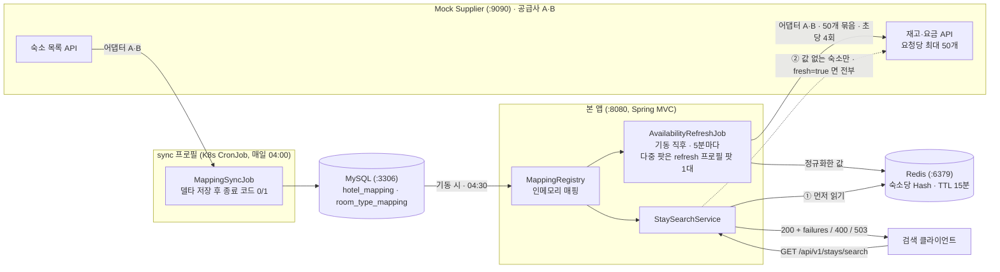

# 아키텍처

> 확정된 설계를 명세해요. 결정의 근거는 [README.md](../README.md) 4장, 결정 과정은 [JOURNAL.md](../JOURNAL.md)에 있어요.

## 1. 전체 구성



공급사 호출은 전부 어댑터 A·B를 거쳐요. 어댑터는 WebClient로 `X-Api-Key` 헤더를 붙여 부르고, 연결 1초·응답 3초 타임아웃과 공급사당 초당 4회 호출 한도를 적용해요. 크론잡은 같은 이미지를 `sync` 프로필로 띄운 별도 프로세스예요. 노드를 눌러 코드 출처와 상수를 볼 수 있는 [인터랙티브 로직 지도](https://mjkang4416.github.io/stay-supplier-integration/system-story.html)도 있어요. 원본은 `docs/system-story.html`이에요.

- 호출 방향은 항상 본 앱 → 바깥이에요. 공급사·MySQL·Redis는 본 앱을 호출하지 않아요.
- 요금·재고는 TTL이 있는 Redis 캐시와 응답에만 있고 MySQL에는 매핑만 있어요.
- 검색이 공급사를 직접 부르는 것은 Redis에 값이 없는 숙소와 `fresh=true`뿐이에요. `fresh=true`는 검색 API의 요청 파라미터예요. 예약 직전처럼 최신 값이 꼭 필요할 때 호출하는 쪽이 `GET /api/v1/stays/search?checkIn=…&checkOut=…&adults=2&children=0&fresh=true`처럼 붙이면, 캐시를 건너뛰고 모든 숙소를 공급사에 직접 물어요. 응답의 `source` 필드가 `cache`인지 `supplier`인지로 결과가 어디서 왔는지 알려줘요.

## 2. 모듈·패키지 구조

### 2.1 모듈

| 모듈 | 역할 | 포트 | 진입점 |
|---|---|---|---|
| 루트 `:` | 본 애플리케이션. 프로필로 역할을 나눠요: 기본 = 웹 앱으로 검색 API와 인메모리 매핑 담당, `sync` = 매핑 갱신 잡을 웹 서버 없이 1회 실행 후 종료 | 8080 | `StaySupplierIntegrationApplication` |
| `:mock-supplier` | 공급사 A·B를 흉내 내는 Mock 서버 | 9090 | `MockSupplierApplication` |

- 두 모듈은 서로 코드를 참조하지 않아요. Mock은 외부 시스템을 흉내 내는 것이므로 본 앱의 DTO를 공유하지 않아요.
- 한 저장소에 두는 이유는 같이 빌드·관리하고 평가자가 한 번에 받기 위해서예요. 실행 시점에는 별개 프로세스예요.

### 2.2 패키지

기능별로 나눠요. `supplier`는 인터페이스·설정·WebClient·호출 한도·묶음·실패 판정, `supplier.a`·`supplier.b`는 공급사별 어댑터와 package-private 전용 응답 형식, `stay`는 어댑터 밖으로 나가는 표준 형태, `mapping`·`cache`·`search`는 각 기능, `config`는 설정 바인딩과 빈 등록이에요.

의존 방향은 `search`·`cache`·`mapping` → `supplier` 인터페이스·`stay`이고, 공급사 구현 패키지 `supplier.a`·`supplier.b`를 참조하는 곳은 `config`뿐이며 그마저도 컴포넌트 스캔으로 찾아요. 새 공급사는 `supplier/c`를 더하면 되고 다른 패키지는 바뀌지 않아요.

### 2.3 코드 읽는 순서

핵심 흐름 순이에요.
1. `search/StaySearchService` - 검색 한 건이 Redis → 공급사 직접 호출 → 병합으로 흐르는 전체 그림. `StaySearchController`, `SearchExceptionHandler`가 입구와 오류 응답
2. `supplier/SupplierClient` → `supplier/a/SupplierAClient`, `supplier/b/SupplierBClient` - 공급사 호출과 표준 형태로의 번역. `SupplierFailures`·`FailureReason`이 실패 판정 통일, `ChunkedFetch`가 50개 묶음과 부분 실패, `SupplierWebClients`·`SupplierRateLimiter`가 타임아웃·헤더·호출 한도
3. `mapping/MappingSyncJob` - 크론잡의 델타 반영. `MappingRegistry`·`MappingRegistryLoader`가 인메모리, `MappingSyncRunner`가 sync 프로필 종료 코드
4. `cache/AvailabilityRefreshJob` → `AvailabilityCache` - 요금·재고를 Redis에 미리 채우는 쪽과 저장 형식 `CachedRate`
5. `mock-supplier/.../MockSupplierController` - 공급사 대역과 장애 모드

## 3. 유스케이스와 핵심 흐름

### 3.1 UC-1 매핑 생성·갱신

- 목적: 공급사의 숙소·객실 타입 코드를 내부 식별자에 대응시켜 저장해요.
- 트리거: 매일 04:00 Asia/Seoul에 K8s CronJob이 `sync` 프로필로 1회 실행해요. 로컬은 `./gradlew :bootRun --args='--spring.profiles.active=sync'`예요. 웹 앱은 매핑을 만들지 않고 기동 시와 04:30에 DB에서 읽어요. 결정 근거는 README 4.2
- 기본 흐름
  1. 공급사별 숙소 목록 API를 호출해요.
  2. 숙소마다 공급사와 숙소 코드 조합에 대한 내부 숙소 식별자를 확보해요. 이미 있으면 재사용해요.
  3. 객실 타입마다 공급사·숙소 코드·객실 타입 코드 조합에 대한 내부 객실 타입 식별자를 확보해요.
  4. 공급사별 건수와 실패 여부를 기록해요.
- 대안 흐름
  - A1: 공급사 목록 조회가 실패했을 때 → 30초 × 3회 재시도, 그래도 실패면 그 공급사만 건너뛰고 기존 매핑 유지, 종료 코드 1로 끝나 K8s가 다시 실행.
  - A2: 잡을 다시 돌렸을 때 → 같은 공급사 코드는 같은 내부 식별자.
  - A3: 목록에서 숙소가 사라졌을 때 → `active=false`로만 표시. 절반 넘게 사라지면 공급사 장애로 보고 비활성화를 보류하고 알림.
  - A4: 잡이 동시에 두 번 돌았을 때 → 식별자가 중복 생성되지 않음.

### 3.2 UC-2 통합 검색

- 목적: 날짜·인원으로 보유 숙소 전체의 예약 가능 객실과 요금을 하나의 형태로 돌려줘요.
- 트리거: `GET /api/v1/stays/search`
- 사전 조건: 매핑이 저장되어 있어요.
- 기본 흐름
  1. 날짜 순서와 인원을 검증해요.
  2. 인메모리 매핑의 보유 숙소 전체에 대해 Redis에서 객실 타입 × 숙박일 값을 읽어요. 값이 있는 숙소는 여기서 끝나요.
  3. 값이 없는 숙소만 공급사별 코드 묶음으로 나눠 재고·요금 API를 병렬 호출해요. 요청에 `fresh=true`가 있으면 캐시를 건너뛰고 전부 직접 호출해요. `fresh=true`는 예약 직전처럼 최신 값이 꼭 필요할 때 호출하는 쪽이 붙이는 요청 파라미터예요. 요청당 50개 묶음, 연결·응답 타임아웃, 호출 한도가 적용돼요.
  4. 응답을 표준 모델로 정규화하고 공급사별로 실패를 판정해요.
  5. 요청 기간 전체의 예약 가능 객실 수를 판정해요.
  6. 공급사별 결과를 병합하고, 부분 실패 사실을 담아 응답해요.
- 대안 흐름
  - A1: 잘못된 요청일 때, 예를 들어 체크아웃이 체크인보다 빠르거나 인원이 0 → 공급사를 부르지 않고 400.
  - A2: 일부 공급사가 장애 응답을 줬을 때, HTTP 4xx·5xx 또는 200 + 실패 코드 → 그 공급사만 빼고 200 + `failures`.
  - A3: 일부 공급사가 응답하지 않을 때 → 3초 타임아웃 뒤 A2와 같게.
  - A4: 캐시에서 읽은 숙소가 없고 모든 공급사가 실패했을 때 → 503 + `Retry-After: 5` + `failures`.
  - A5: 기간 중 하루라도 재고가 0일 때 → 예약 불가. 기본은 응답에서 제외, `includeSoldOut=true`면 0으로 포함.
  - A6: 매핑이 비어 있을 때 → 빈 결과.
  - A7: 응답 정규화가 실패했을 때 → 항목 하나의 필드 누락은 그 항목만 빼고 로그, `maxOccupancy` 누락은 미상으로 살림. 본문 구조가 깨졌으면 그 공급사의 실패 `INVALID_RESPONSE`.
  - A8: 보유 숙소가 50개를 넘을 때 → 공급사 API는 한 요청에 숙소 50개까지만 받으므로 50개씩 나눠 병렬 호출.
  - A9: Redis에 값이 없는 숙소가 있을 때, 즉 앱을 막 켜서 첫 갱신 전이거나 요청 날짜가 오늘부터 30일 범위 밖이거나 키가 만료됐을 때 → 그 숙소만 공급사에 직접 호출. 캐시에서 읽은 숙소가 하나도 없으면 응답의 `source`는 `supplier`.
  - A10: Redis 자체에 연결이 안 될 때 → 전부 공급사에 직접 호출하고 응답의 `source`는 `supplier`.
  - A11: 갱신 잡의 마지막 시도가 실패한 공급사가 있을 때 → 캐시로 응답하되 `failures`에 그 공급사와 원인을 표시.

### 3.3 UC-3 요금·재고 캐시 갱신

- 목적: 검색이 공급사를 부르지 않고 응답하도록 오늘\~+30일의 재고·요금을 Redis에 미리 채워요.
- 트리거: 웹 앱 기동 직후, 그 뒤 5분마다예요. 주기는 `cache.refresh-interval`이에요.
- 기본 흐름
  1. 인메모리 매핑에서 공급사별 active 숙소 코드를 꺼내요.
  2. 어댑터의 날짜별 조회를 호출해요. A는 기간 한 번, B는 날짜마다 1박 호출이고 adults=1로 모든 객실 타입을 받아요. 50개 묶음·호출 한도 적용.
  3. 공급사 코드를 내부 식별자로 바꿔 숙소당 Hash에 쓰고 15분 뒤 자동 삭제되도록 TTL을 걸어요. 갱신이 정상이면 5분마다 다시 써서 15분이 새로 시작되고, 갱신이 멈추면 15분 뒤 값이 사라져 검색이 직접 호출로 넘어가요. 공급사별 상태 키에 성공 시각을 기록해요.
- 대안 흐름
  - A1: 공급사가 실패했을 때 → 그 공급사만 건너뛰고 상태 키에 원인·시각 기록. 값은 TTL까지 유지하고 검색이 `failures`에 표시.
  - A2: 묶음 일부가 실패했을 때 → 성공한 묶음만 쓰고 실패 묶음은 로그.
  - A3: 매핑에 없는 코드를 받았을 때 → 버림. 다음 새벽 크론잡이 채우면 그때부터.
  - A4: Redis 쓰기가 실패했을 때 → 이번 갱신은 실패 로그, 다음 주기에 다시. 검색은 저하 모드.
  - A5: 429를 받았을 때 → 지수 백오프 뒤 그 공급사 호출 한도를 절반으로.

## 4. 공급사 연동 규칙

유스케이스 셋이 공통으로 쓰는 규칙이에요. 결정과 이유는 [README 4장](../README.md)에 있어요.

### 4.1 실패 판정

A는 HTTP 상태 코드로, B는 항상 200에 본문 `resultCode`로 실패를 알려요. 둘과 응답을 아예 못 받은 경우를 같은 `FailureReason` 하나로 바꿔서, 크론잡·갱신 잡·검색은 이 원인만 보고 재시도와 알림을 정해요.

| `FailureReason` | Supplier A HTTP 상태 | Supplier B `resultCode` | 응답을 못 받았을 때, A·B 공통 |
|---|---|---|---|
| `INVALID_REQUEST` | 400 `INVALID_DATE_RANGE`·`INVALID_PARAMETER`·`TOO_MANY_HOTEL_CODES`, 그 밖의 4xx | `E400` | |
| `UNAUTHORIZED` | 401 | `E401` | |
| `RATE_LIMITED` | 429. `Retry-After`가 초 단위면 예외에 실어요 | `E429` | |
| `SUPPLIER_ERROR` | 500, 그 밖의 5xx | `E500` | |
| `UNAVAILABLE` | 503 | `E503` | B가 스펙과 달리 HTTP 오류를 주면 A와 같은 상태 규칙으로 판정 |
| `TIMEOUT` | | | 응답 타임아웃 초과 |
| `CONNECTION` | | | 연결 거부·연결 타임아웃·DNS 실패 |
| `INVALID_RESPONSE` | 본문 파싱 실패, `items` 구조 없음 | 모르는 `resultCode`, `0000`인데 `data.items` 구조 없음 | 코덱 오류 |

### 4.2 신규 Supplier 추가 절차

고치는 곳과 고치지 않는 곳은 [README 4.3](../README.md)에, 단계별 절차는 `.claude/skills/add-supplier`에 있어요.

### 4.3 재시도·서킷 브레이커

구현 상태: 재시도는 구현이고 설정은 `mapping.sync.retry-*`, `search.retry-*`, `cache.rate-limit-*`예요. 서킷 브레이커는 설계만이에요.

| 원인 | 크론잡 · 새벽, 사람 안 기다림 | 검색 직접 호출 · 사람 기다림 | Redis 갱신 잡 · 5분마다 |
|---|---|---|---|
| 연결 실패, 500, 503 | 고정 30초 × 3회 | 즉시 1회, 대기 0\~200ms | 다음 갱신 |
| 타임아웃 | 고정 30초 × 3회 | 없음, 이미 3초 소진 | 다음 갱신 |
| 429 | 위와 같음, 고정 간격. `Retry-After` 값을 대기에 쓰는 것은 확장 | 없음, 더 부르면 악화 | 지수 백오프 1→2→4→…초, 60초 상한, 최대 5회, 설정은 `cache.rate-limit-*`. 호출 한도는 429마다 절반이고 하한은 초당 0.5회 |
| 400·401, B `resultCode` 오류, 깨진 응답 | 없음, 다시 해도 같음 | 없음 | 없음 |

서킷 브레이커 설계: 최근 10회 중 5회 이상 실패 → 30초 동안 그 공급사를 부르지 않고 `failures`에 `CIRCUIT_OPEN`으로 표시. 30초 뒤 시험 호출 1회 성공 → 복구. 검색 직접 호출과 갱신 잡에만 걸고 크론잡에는 걸지 않아요.

### 4.4 연동 지표·모니터링

구현 상태: 설계만. 코드는 공급사·원인·원본 코드가 담긴 실패 로그만 남겨요.

- 지표: 공급사 호출 성공률·타임아웃 비율·429 비율·p95 지연, 검색의 부분 실패 비율, 크론잡·리로드 결과. `SupplierWebClients`의 필터 한 곳에서 기록해요.
- 알림: 공급사·DB·Redis 연결 실패는 1건 이상이면 알리고, 같은 대상·원인은 5분 안에서 하나로 묶어요. 429 비율 > 1%, 부분 실패 비율 > 5%, 성공률 < 97%, 타임아웃 비율 > 2%는 긴급이에요.
- 호출 한도 조정: 429를 받으면 코드가 그 공급사 한도를 절반으로 줄이고, 올리는 건 사람이 설정값으로 해요.

### 4.5 요금·재고 캐시

구현 상태: 갱신 잡 `AvailabilityRefreshJob`, 저장소 `AvailabilityCache`, 검색의 Redis 우선 읽기, 호출 한도 `SupplierRateLimiter`는 구현. 날짜 거리별 주기 계층, 남은 객실 ≤ 2 핫 리스트, readiness 연동은 설계만. 팟이 여러 대면 `refresh` 프로필의 갱신 전용 팟 1대가 갱신 잡을 맡고 웹 팟은 `cache.refresh-enabled=false`로 꺼요. 배치는 5장. 결정과 이유는 [README 4.6](../README.md)에 있어요.

```
키       stay:v1:{hotelId}              숙소당 Hash 하나. TTL = 주기 × 3 = 15분
필드     {roomTypeId}:{yyyyMMdd}        값: 재고|세금 포함 1박 요금|통화|조식(0/1)|최대 인원(없으면 빈 칸)   예) 11:20260901 → 3|132000|KRW|0|2
         _refreshedAt                   마지막 갱신 시각
상태 키  stay:v1:status:{supplier}      마지막 성공 시각, 마지막 실패 원인·시각. 갱신이 실패한 공급사를 검색이 failures 에 드러내기 위한 것
```

- 갱신 잡: 5분마다 인메모리 매핑의 공급사별 코드를 50개씩 묶어 오늘부터 30일치를 받아요. A는 날짜별 값을 주니 30일 기간으로 한 번 부르고, B는 기간 총액만 주니 하루씩 30번 불러 1박 값을 받아요. 인원은 adults=1로 불러 모든 객실 타입을 저장하고 검색할 때 요청 인원으로 걸러요. 숙소 Hash는 칸을 하나씩 덮어쓰지 않고 지우기 → 새로 쓰기 → 만료 걸기를 한 트랜잭션으로 묶어 통째로 바꿔요. 어제 날짜나 사라진 객실 타입 칸이 남지 않게 하기 위해서예요.
- 검색: 숙소마다 HMGET으로 객실 타입 × 숙박일 값을 읽어 최솟값 재고와 합산 요금을 만들어요. 값이 없는 숙소만 직접 호출하고, 요청에 `fresh=true`가 있으면 캐시를 건너뛰고 전부 직접 호출해요. 상태 키의 마지막 시도가 실패면 `failures`에 표시해요.
- 호출 한도: 공급사당 초당 4회, 429를 받으면 절반. 갱신 잡은 429에만 지수 백오프 1→2→4…초, 60초 상한, 최대 5회.
- 주기와 용량: 5분. 숙소 1,000개면 갱신 한 번에 A 20회 + B 600회 = 620회라 초당 4회로 2.6분. 5,000개부터는 날짜 거리별 계층이 필요해서 설계만. 숙소당 약 6KB라 10,000개에 60MB.
- 설정 키: `supplier.rate-limit.per-second`, `cache.refresh-interval`, `cache.window-days`, `cache.ttl-multiplier`, `cache.rate-limit-*`.

## 5. 운영 구성 (설계)
같은 이미지를 두 워크로드로 배포해요.

| 워크로드 | 프로필 | 역할 |
|---|---|---|
| Deployment, 팟 N개 | 기본, `cache.refresh-enabled=false` | 검색 API. 기동 시 DB의 숙소·객실 타입 매핑을 인메모리로, 매일 04:30 Asia/Seoul 한 번 더 로드. 갱신 잡은 끄고 Redis만 읽어요 |
| Deployment, 팟 1개 | `refresh` | 요금·재고 갱신 잡. 웹 서버 없이 떠서 매핑을 인메모리로 올리고 5분마다 Redis를 채워요. 이 팟이 죽으면 값은 TTL 15분까지 남고 그 뒤 검색은 직접 호출로 넘어가요. 팟이 하나뿐인 로컬은 기본 프로필이 검색과 갱신을 같이 해요 |
| CronJob `0 4 * * *`, `timeZone: Asia/Seoul` | `sync` | 매핑 갱신 잡 1회 실행. 공급사 실패 시 종료 코드 1 → `backoffLimit: 2`로 최대 3회 실행하고 upsert라 재실행이 안전해요. 수동 실행·첫 배포는 `kubectl create job --from=cronjob/<name>` |

`concurrencyPolicy: Forbid`로 갱신 잡이 겹쳐 돌지 않게 해요. 앱 안의 고정 30초 × 3회 재시도는 공급사 호출에만 걸고, DB 연결 실패처럼 앱 밖의 원인은 잡 수준 재실행이 맡아요. 잡 실패 이벤트와 마지막 성공 시각이 25시간을 넘으면 메트릭 모니터로 알려요. 규칙은 4.4예요.
